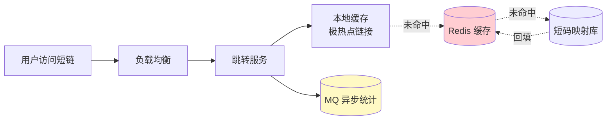
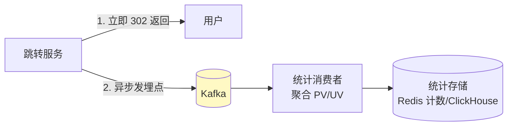

# 精通设计短链系统

> 短链系统（TinyURL / 短网址）是系统设计的"入门第一题"——它够简单，能在 45 分钟讲完；又够典型，覆盖了发号、缓存、读写分离、防刷、统计等一整套通用技能。把它讲透，很多题就有了套路。
>
> 这一篇严格按 RESHADED 流程走一遍：需求 → 估算 → API → 高层架构 → 核心算法（短码生成）→ 详细设计 → 扩展。

---

## 一、需求与规模

### 1.1 功能需求

- **核心**：长链接 → 短链接；访问短链 → 302 跳转到原链。
- **次要**（先放一边，按面试节奏决定要不要展开）：自定义短码、过期时间、点击统计、用户管理。

### 1.2 非功能需求

- **高可用**：短链跳转是核心路径，挂了所有分发的链接都失效，要求高可用。
- **低延迟**：跳转要快（p99 < 100ms），用户无感。
- **读多写少**：一条短链生成一次、被点击很多次。**读写比可达 100:1 甚至更高**——这是架构的关键约束，决定了重点在读侧。

### 1.3 容量估算

参照 [S02](./S02-精通-容量估算与必背数字.md) 的套路，先亮假设：

- 假设每天新增 1 亿条短链。
- 写 QPS = 1e8 / 1e5 ≈ **1000/s**（均值），峰值 ×5 ≈ 5000/s。
- 读 QPS 按 100:1 ≈ **10万/s**（均值），峰值 ≈ 50万/s。
- 存储：单条约 100B（短码 + 长链 + 元数据），5 年 ≈ 1e8 × 365 × 5 × 100B ≈ **18 TB**（含副本约 50TB）。

**结论**：写 5000/s 单库可扛，**不必一上来分片**；读 50万/s 是核心挑战，**必须重度缓存**；18TB 量级单库偏大，需分库或用 KV 存储。

---

## 二、API 设计

```
POST /api/urls
  Body: { "long_url": "https://...", "custom_code?": "...", "expire_at?": "..." }
  Resp: { "short_url": "https://t.cn/aBc123" }

GET /{short_code}
  Resp: 302 Found, Location: <long_url>

GET /api/urls/{short_code}/stats
  Resp: { "pv": 12345, "uv": 6789 }
```

跳转用 `GET /{short_code}` 直接挂在短域名根路径下，短码越短越好（短域名 + 短码 = 短链的价值）。

---

## 三、核心·短码生成

这是短链系统的灵魂。目标：短码尽量短、唯一、生成高效。主流四种方案：

| 方案 | 做法 | 短码长度 | 可预测性 | 冲突 | 有序性 | 评价 |
|---|---|---|---|---|---|---|
| ① 自增 ID + Base62 | 全局自增 ID 转 62 进制 | 短（可控） | 可预测（连续） | 无 | 严格递增 | **推荐**，简单可控 |
| ② 号段发号 | 从发号器批量取 ID 段，本地用 | 短 | 可预测 | 无 | 趋势递增 | 高并发友好 |
| ③ 雪花 ID + Base62 | 雪花 ID 转 62 进制 | 偏长（ID 大） | 较难预测 | 无 | 趋势递增 | 短码偏长 |
| ④ 哈希取前几位 | MD5(长链) 取前 6-7 位 Base62 | 短 | 难预测 | **有冲突** | 无序 | 要处理冲突 |

### 3.1 Base62 编码

62 = `0-9A-Za-z`。把自增 ID 转成 62 进制，长度极短：

```go
const charset = "0123456789abcdefghijklmnopqrstuvwxyzABCDEFGHIJKLMNOPQRSTUVWXYZ"

func toBase62(id uint64) string {
    if id == 0 {
        return "0"
    }
    var b []byte
    for id > 0 {
        b = append([]byte{charset[id%62]}, b...)
        id /= 62
    }
    return string(b)
}
```

**编码空间估算**：62^6 ≈ 568 亿，62^7 ≈ 3.5 万亿。所以 **6-7 位短码足够编码海量短链**（呼应 [S02](./S02-精通-容量估算与必背数字.md) 的 2 的幂直觉）。

### 3.2 为什么发号优于哈希

哈希方案（④）的致命问题是**冲突**：不同长链可能哈希到同一短码，必须检测冲突并重试（加盐再哈希），高并发下冲突处理是麻烦。而**发号方案（①②）天然无冲突**——每个 ID 唯一，转出来的短码就唯一。所以**生产首选自增/号段发号**。

发号器本身要高可用、可水平扩展，参考 [M16 分布式 ID](../microservices/16-精通-分布式-ID.md)：单点自增是瓶颈，用号段模式（批量取 ID 缓存本地）或多发号器分段（如各发号器步长不同）。

### 3.3 可预测性问题

自增 ID 转的短码是连续可预测的（`aBc124` 的下一个是 `aBc125`），可能被遍历爬取。如果介意，可对 ID 做可逆混淆（如固定的位运算/加密置换）再 Base62，破坏连续性但仍无冲突。

---

## 四、跳转用 301 还是 302

| 方案 | 含义 | 优点 | 代价 |
|---|---|---|---|
| 301 永久重定向 | 浏览器缓存该跳转 | 后续访问不回服务器，省压力、跳转快 | **丢失点击统计**（缓存命中后服务器看不到） |
| 302 临时重定向 | 不缓存，每次回服务器 | 每次都能统计 PV/UV | 服务器压力大 |

**取舍**：短链产品通常**强依赖点击统计**（这是短链的商业价值），所以**默认用 302**，配合缓存抗压。如果是纯跳转、不在乎统计、要极致省成本，才用 301。面试时主动讲这个权衡，是加分点（HTTP 语义见 [B02](../backend/B02-精通-HTTP-语义.md)）。

---

## 五、存储模型与容量

核心就是一张映射表：

```
short_code (PK) | long_url | created_at | expire_at | creator_id | click_count
```

选型：

- **关系库（MySQL/PG）**：够用，`short_code` 做主键。18TB 量级需按 `short_code` 哈希分库分表（见 [S04](./S04-精通-数据层扩展设计.md)），或先单库 + 读副本。
- **KV 存储**：短链本质是 KV（短码→长链），用 KV 库（如 TiKV、Cassandra）天然适配、易水平扩展。

由于查询永远是"按 short_code 查 long_url"（单点查询，无复杂查询），**KV 模型最贴合**，分片键就是 short_code。

---

## 六、缓存与防穿透

读 50万/s 必须缓存。短链是缓存的完美场景（读多写少、KV 结构、热点明显——少数链接被疯狂点击）。



- **多级缓存**：极热点链接进程内本地缓存兜底，Redis 扛大部分，DB 兜底（见 [S05](./S05-精通-缓存与异步化设计.md)）。
- **防穿透**：大量访问不存在的短码（恶意遍历）会穿透到 DB。用**布隆过滤器**拦截"一定不存在"的短码，或**缓存空值**（短 TTL）。短链场景布隆过滤器很合适：所有有效短码进布隆，不在里面的直接 404。
- **缓存命中率**：热点集中，命中率可做到 95%+，回源 DB 降到 ~2.5万/s，分库后可承受。

---

## 七、点击统计

302 每次回源，可在跳转时埋点统计 PV/UV。但**统计不能阻塞跳转**（跳转要快），所以**异步化**：



- 跳转主流程只发一条埋点消息（含 short_code、时间、IP/UA），立即返回 302。
- 消费者异步聚合：PV 用计数器，UV 用 HyperLogLog（去重估算，省内存，见 [S10](./S10-精通-设计排行榜与计数系统.md)）。
- 明细量大可写 ClickHouse 做多维分析（按时间/地域/来源）。

---

## 八、扩展

- **自定义短码**：用户指定 `custom_code`。要检测冲突（已被占用则报错）；自定义码和发号码要隔离命名空间（如自定义码加前缀），避免和自增码撞。
- **过期与清理**：`expire_at` 到期后短码失效。清理用惰性删除（访问时判断过期）+ 定时任务批量清理，过期短码可回收复用。
- **防恶意 / 风控**：短链常被用于钓鱼/导流违规内容。要做：长链黑名单校验、生成限流（防刷量）、可疑链接人工审核、访问时安全检测。
- **多机房**：短链是读密集 + 全球访问，适合多地部署 + CDN/就近接入（见 [S03](./S03-精通-接入层与水平扩展.md)），映射数据只读副本同步即可。

---

## 陷阱清单

- **用哈希做短码不处理冲突**：不同长链撞短码，跳错目标。发号方案天生无冲突，优先选。
- **301 还想要点击统计**：301 被浏览器缓存后服务器收不到请求，统计全丢。要统计就用 302。
- **统计阻塞跳转**：同步写统计拖慢跳转。必须异步埋点。
- **不防穿透**：恶意遍历不存在的短码打爆 DB。上布隆过滤器/缓存空值。
- **自增短码可预测被爬**：连续短码易被遍历抓取全部链接。介意就做可逆混淆。
- **过早分库**：写才 5000/s 就急着分片。先单库 + 读副本 + 缓存，量到了再分。
- **自定义码与系统码冲突**：命名空间不隔离，自定义 `abc` 和自增生成的 `abc` 撞车。

---

## 2026 现状

- **KV / NewSQL 承载**：短链这种纯 KV + 海量数据场景，越来越多直接用 TiKV、Cassandra、DynamoDB 等，省去手工分库分表，见 [S04](./S04-精通-数据层扩展设计.md)。
- **边缘计算跳转**：用 Cloudflare Workers / CDN 边缘函数做跳转，把映射数据下沉到边缘 KV（如 Workers KV），实现全球超低延迟跳转，源站只管写入。
- **统计走实时数仓**：ClickHouse / Doris 成为点击明细分析的主流，支持秒级多维下钻。
- **安全合规趋严**：短链被滥用于诈骗，国内平台需落实长链审核、可追溯、违规链接快速封禁。

---

## 练习题

1. 估算一个每天新增 5000 万短链、读写比 200:1 的短链系统的读写峰值 QPS 和 5 年存储量，并据此判断是否需要一开始就分库。

<details><summary>参考答案</summary>

写均值 = 5e7/1e5 = 500/s，峰值 ×5 ≈ 2500/s；读均值 = 500×200 = 10万/s，峰值 ≈ 50万/s；存储 5e7×365×5×100B ≈ 9TB（×3 副本 ≈ 27TB）。写 2500/s 单库完全可扛，**不必一开始分库**；读 50万/s 是核心矛盾，靠多级缓存解决；存储 9TB 裸数据单库偏大，可先垂直分或用 KV，待增长再水平分片。结论：先单库/KV + 读副本 + 重缓存，写或数据量到瓶颈再分片。

</details>

2. 对比"自增 ID + Base62"和"MD5 哈希取前 7 位"两种短码生成方案，说明各自优缺点，以及你会选哪个、为什么。

<details><summary>参考答案</summary>

自增+Base62：无冲突、短码可控且最短、生成快；缺点是连续可预测（可被遍历），且依赖全局发号器。哈希取前 7 位：不可预测、无需中心发号；致命缺点是**会冲突**（不同长链撞同一短码），必须检测冲突并加盐重试，高并发下冲突处理复杂，且同一长链每次生成不同短码（除非额外查重）。**选自增+Base62**：短链系统最看重唯一性和短码长度可控，发号方案天生无冲突；若担心可预测，对 ID 做可逆混淆即可，代价远小于处理哈希冲突。

</details>

3. 短链跳转用 301 还是 302？请从"点击统计"和"服务器压力"两个角度分析，并给出你的默认选择。

<details><summary>参考答案</summary>

301 永久重定向被浏览器缓存，后续访问不再回源——优点是省服务器压力、跳转更快，缺点是**统计失真**（缓存命中后服务器看不到点击）。302 临时重定向每次回源——优点是能精确统计每次 PV/UV，缺点是服务器压力大。短链产品的核心商业价值之一就是点击分析，**默认选 302**，再用多级缓存扛住回源压力；只有在纯跳转、完全不关心统计、追求极致省成本时才用 301。

</details>

4. 你的短链系统遭到恶意遍历攻击（大量请求随机短码），DB 压力骤增。有哪些设计手段防护？

<details><summary>参考答案</summary>

①**布隆过滤器**：把所有有效短码放入布隆过滤器，请求先过滤，"一定不存在"的直接返回 404，根本不查 DB（短链场景非常契合）。②**缓存空值**：对查出来不存在的短码，缓存一个空标记（短 TTL），避免重复穿透。③**限流/风控**：对单 IP 的高频随机访问限流、拉黑。④**短码不可预测**：对自增 ID 做混淆，增加遍历难度。⑤ 多级缓存兜底，保证 DB 只承受少量真实回源。

</details>

5. 设计点击统计模块，要求不拖慢跳转、能统计 PV 和 UV、支持按时间/地域多维分析。画出数据流。

<details><summary>参考答案</summary>

跳转服务先立即返回 302，再**异步**发一条埋点消息（short_code、时间、IP、UA、referer）到 Kafka，绝不在主链路同步写统计。下游消费者：PV 用计数器累加（Redis INCR 或写 ClickHouse 后聚合）；UV 用 **HyperLogLog** 按 (short_code, 日期) 去重估算，省内存；明细写 **ClickHouse** 支持按时间/地域/来源多维下钻。数据流：`跳转服务 →(302 给用户) + (异步埋点) Kafka → 统计消费者 → Redis 计数 / ClickHouse 明细`。这样统计与跳转解耦，互不影响。

</details>

6. 自定义短码功能如何与系统自动生成的短码共存而不冲突？

<details><summary>参考答案</summary>

核心是**命名空间隔离**：①给两类码不同的字符空间或前缀（如自定义码统一加保留前缀，或自定义码用特定首字符段），使自增生成的码永远不会落进自定义码的取值范围；②自定义码创建时做**唯一性校验**（DB 唯一约束 + 缓存预检），已占用则报错让用户换；③自定义码不参与自增序列。这样自动码和自定义码各自唯一、互不撞车。

</details>

7. 短链数据量达到 18TB，决定分库。你选什么作为分片键？为什么"按 short_code 哈希"是合理的？

<details><summary>参考答案</summary>

选 **short_code** 作分片键，哈希分片。因为短链系统**唯一的高频查询就是"按 short_code 查 long_url"**（跳转），用 short_code 哈希分片能让每次跳转精确路由到单片，无 scatter-gather；short_code 由发号生成、分布均匀，哈希后无热点倾斜；短链几乎没有"按其他维度范围查询"的需求，所以哈希分片牺牲范围查询能力的缺点在这里不存在。若需按用户/时间做后台分析，把数据异构到 ES/ClickHouse 即可，不影响分片库的核心职责。

</details>
