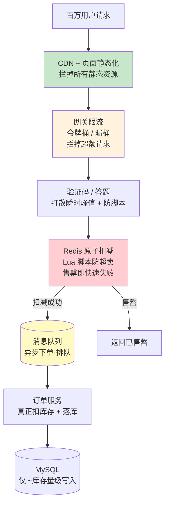
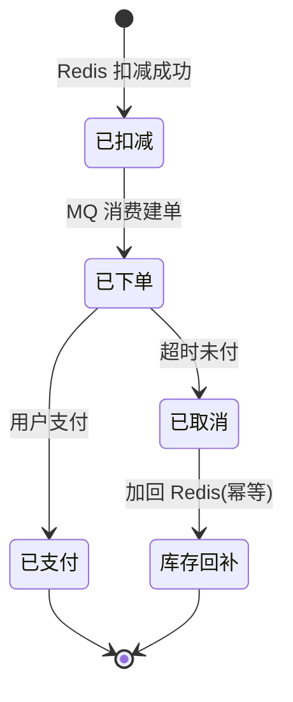

# 精通设计秒杀系统

> 秒杀（Flash Sale）是系统设计的"压力测试题王"——它把高并发、防超卖、限流削峰、热点隔离、最终一致这些硬骨头全压在一道题里。能把秒杀讲透，你对高并发系统的理解就到位了。
>
> 本篇按 RESHADED 走完整流程，核心是一个贯穿始终的思想：**层层削峰漏斗**——把上游的百万请求，一层层过滤到下游数据库能承受的几千请求。

---

## 一、需求与核心难点

### 1.1 功能需求

- 活动开始前展示商品、倒计时；
- 开始瞬间，海量用户抢有限库存；
- 抢到的下单支付，未抢到的快速得到"已售罄"。

### 1.2 核心难点（这道题真正考的）

| 难点 | 说明 |
|---|---|
| **瞬时高并发** | 平时无人，开抢瞬间百万 QPS 脉冲，是平均流量的几十上百倍 |
| **严防超卖** | 100 件库存绝不能卖出 101 件——这是红线 |
| **相对公平** | 不能让脚本/黄牛秒光，普通用户颗粒无收 |
| **不拖垮主站** | 秒杀流量不能挤占正常业务（商品、订单、支付）的资源 |

### 1.3 容量估算

参照 [S02](./S02-精通-容量估算与必背数字.md)：假设一件爆款 1000 库存，活动吸引 1000 万用户，开抢后 10 秒内集中涌入：

- 峰值请求 QPS ≈ 1000万 / 10 × 放大 ≈ **百万级 QPS**。
- 而单 MySQL 主库写仅 **数千 TPS**、单 Redis 约 **10万 QPS**。

**结论**：请求量和后端能力差 2-3 个数量级。**核心矛盾是"如何把百万请求过滤到数据库能扛的几千"**——这就是削峰漏斗的由来。

---

## 二、整体思路·层层削峰漏斗

秒杀架构的灵魂：在每一层尽量多地拦掉无效请求，让真正落到 DB 的请求和库存量级匹配（1000 库存最终只需 ~1000 次有效扣减）。



每一层的过滤倍率叠乘：CDN 拦掉 90%+ 静态请求 → 限流再拦掉一大半 → 验证码打散并挡住脚本 → Redis 库存为 0 后秒拒剩余 → 最终只有 ~1000 个有效请求进 MQ 落库。**百万到几千，靠的是层层相乘的过滤。**

---

## 三、前端与接入层削峰

### 3.1 页面静态化 + CDN

秒杀详情页（商品图、说明、倒计时 JS）全部静态化，推到 CDN。用户开抢前的所有浏览请求在边缘就返回了，根本不碰源站（见 [S03](./S03-精通-接入层与水平扩展.md)）。

### 3.2 按钮控制与防重复点击

- 倒计时由服务端时间驱动，**未到点按钮置灰**，URL（含 token）开抢才下发，防止提前刷接口。
- 点击后立即置灰按钮，防同一用户狂点。

### 3.3 验证码 / 答题打散峰值

开抢瞬间强制验证码或答题，把"同一时刻的尖峰"拉长成几秒的平缓曲线（削峰），同时**有效挡住无脑脚本**（脚本难自动过验证码）。这是公平性 + 削峰的双赢手段。

### 3.4 网关限流

网关层用令牌桶/漏桶限流，把进入后端的 QPS 限制在系统能稳定处理的范围内，超额直接拒绝（返回"活动太火爆，请重试"）。限流算法详见 [B21 背压与限流](../backend/B21-精通背压与限流.md)。

---

## 四、防超卖核心方案

这是秒杀的技术核心。**超卖的根本原因：库存"读-改-写"不是原子操作**——多个请求同时读到库存 10，各自减 1 写回 9，结果卖了多份但库存只减了 1。

五种方案对比：

| 方案 | 机制 | 优点 | 缺点 |
|---|---|---|---|
| ① DB 乐观锁 | `UPDATE ... SET stock=stock-1 WHERE stock>0` | 实现简单、DB 保证原子 | 高并发下大量失败重试，DB 压力大 |
| ② DB 悲观锁 | `SELECT ... FOR UPDATE` 再扣 | 严格串行、不超卖 | 锁竞争激烈、吞吐低，秒杀不可用 |
| ③ Redis DECR | `DECR stock` 原子自减 | 快、抗并发 | DECR 可能减成负数，需额外判断 |
| ④ Redis + Lua | Lua 脚本里判断+扣减，原子执行 | 快且不超卖，**推荐** | 需写 Lua、Redis 与 DB 最终一致 |
| ⑤ 预扣 + 确认 | Redis 预扣，下单成功再确认/支付超时回补 | 兼顾性能与准确 | 逻辑复杂，需回补机制 |

### 4.1 DB 乐观锁（适合中小规模）

```sql
-- stock 作为 CAS 条件，影响行数=1 才算扣减成功
UPDATE seckill_stock
SET stock = stock - 1
WHERE product_id = ? AND stock > 0;
```

`WHERE stock > 0` 保证不会扣成负数；靠 DB 行锁的原子性杜绝超卖。但百万并发全压 DB 不现实，所以秒杀通常**用 Redis 扛流量、DB 只做最终落库**。

### 4.2 Redis + Lua（高并发首选）

把"判断库存 + 扣减"放进一个 Lua 脚本，Redis 单线程执行保证原子，杜绝竞态：

```lua
-- KEYS[1]=库存key  ARGV[1]=本次购买数量
local stock = tonumber(redis.call('GET', KEYS[1]))
if stock == nil then
    return -1            -- 库存不存在
end
if stock < tonumber(ARGV[1]) then
    return 0             -- 库存不足，售罄
end
redis.call('DECRBY', KEYS[1], ARGV[1])
return 1                 -- 扣减成功
```

Go 侧调用：

```go
const seckillScript = `... 上面的 Lua ...`

func TryDeduct(ctx context.Context, rdb *redis.Client, key string, qty int) (bool, error) {
    r, err := rdb.Eval(ctx, seckillScript, []string{key}, qty).Int()
    if err != nil {
        return false, err
    }
    switch r {
    case 1:
        return true, nil          // 抢到
    case 0:
        return false, nil         // 售罄
    default:
        return false, ErrNoStock  // key 不存在
    }
}
```

活动开始前把库存预热进 Redis。扣减成功的用户才进入下单流程，售罄后所有请求被 Redis 瞬间挡掉（一次内存操作），DB 毫无压力。

---

## 五、异步下单

Redis 扣减成功 ≠ 下单完成。若每个成功请求都同步落库 + 建订单 + 调支付，DB 仍会被瞬间打满。所以**扣减成功后发一条消息进 MQ，订单服务按自己的速率消费、真正落库**：

```go
func Seckill(ctx context.Context, userID, productID int64) (string, error) {
    ok, err := TryDeduct(ctx, rdb, stockKey(productID), 1)
    if err != nil { return "", err }
    if !ok { return "", ErrSoldOut }     // 售罄，快速失败

    // 扣减成功：发 MQ 异步创建订单，立即返回"排队中"
    msg := OrderMsg{UserID: userID, ProductID: productID, Token: newToken()}
    if err := producer.Send(ctx, "seckill.order", msg); err != nil {
        rdb.IncrBy(ctx, stockKey(productID), 1) // 发送失败回补库存
        return "", err
    }
    return msg.Token, nil                 // 前端拿 token 轮询下单结果
}
```

要点：
- **MQ 削峰**：百万扣减成功（实际只有库存量级）的消息排队，订单服务平稳消费，DB 写入控制在几千 TPS 以内。
- **前端轮询**：返回一个 token，前端轮询"我的订单状态"，从"排队中"变"已下单"。
- **消费幂等**：消息可能重复，订单服务按 token/用户+商品唯一键幂等（见 [S05](./S05-精通-缓存与异步化设计.md)、[M09 幂等](../microservices/09-精通-幂等与去重.md)）。

---

## 六、热点商品隔离与库存分桶

### 6.1 热点 key 隔离

爆款商品的库存 key 会成为超级热点，集中打爆某个 Redis 节点。对策：

- 热点商品库存放**独立的 Redis 实例/集群**，与普通业务隔离，避免拖垮整体。
- 多级缓存：商品详情等只读数据用本地缓存兜底。

### 6.2 库存分桶（分段扣减）

单个库存 key 即使有 Lua 原子保证，所有请求仍**串行**争抢这一个 key，成为吞吐瓶颈。把 1000 库存拆成 10 桶各 100：

```
stock:1001:bucket0 = 100
stock:1001:bucket1 = 100
...
stock:1001:bucket9 = 100
```

请求随机/哈希落到某个桶扣减，**把单 key 竞争分散到 10 个 key**，吞吐提升近 10 倍。代价：某桶卖空但其他桶有货时，需要跨桶兜底（重试其他桶），逻辑变复杂。这是"性能 vs 复杂度"的典型权衡。

---

## 七、库存最终一致与回补

Redis 扣了库存，但订单可能未支付。需要保证 Redis 库存与 DB 实际售出最终一致：

- **超时未支付→关单→回补库存**：下单后给用户有限支付时间（如 15 分钟），超时未付则关闭订单，把库存**加回 Redis**（用延迟队列触发，见 [S14 延迟队列](./S14-精通-设计延迟队列与定时任务.md)）。
- **Redis 与 DB 对账**：定时比对 Redis 剩余库存 + DB 已售订单 = 总库存，发现偏差告警/修正（见 [S05](./S05-精通-缓存与异步化设计.md) 的对账思想）。
- **回补要幂等**：避免重复回补导致"凭空多货"超卖。



---

## 八、限流·熔断·降级

秒杀是典型的"宁可拒绝、不可拖垮"场景，多级防护：

- **多级限流**：网关层（总闸）、应用层（按接口/用户）、资源层（DB/Redis 连接池），层层设上限。
- **熔断**：下游（订单/支付）异常时快速熔断，返回兜底，不让请求堆积拖垮线程池（Little 定律，见 [S02](./S02-精通-容量估算与必背数字.md)）。
- **降级**：极端压力下关闭非核心功能（如实时销量展示），保住核心抢购链路。

详见 [B21 背压与限流](../backend/B21-精通背压与限流.md)、[M11 限流熔断降级](../microservices/11-精通-限流熔断降级.md)。

---

## 九、防刷与公平性

- **限购**：每用户每商品限购 N 件，Redis 记录已购，超限拒绝。
- **风控**：识别黄牛特征（同设备/IP 多账号、请求频率异常、无浏览直接下单），拉黑或加验证。
- **验证码/答题**：如第三节，既削峰又挡脚本。
- **令牌/预约**：开抢前预约获取资格 token，无 token 不能抢，把竞争前置且可控。

公平性永远是"提高作弊成本"而非"绝对杜绝"——目标是让普通用户有合理机会。

---

## 陷阱清单

- **库存读-改-写不原子**：超卖头号原因。必须用 Lua/乐观锁/DB 行锁保证原子。
- **`DECR` 减成负数**：纯 DECR 不判断会扣成负数。要先判断或用 Lua。
- **同步落库**：扣减成功就同步建单/支付，DB 被打爆。必须异步化 + MQ 削峰。
- **单库存 key 成瓶颈**：所有请求串行争一个 key。大爆款要分桶。
- **不回补库存**：超时未付不回补，库存白白锁死，少卖。回补要幂等防超卖。
- **限流只在一层**：只在网关限流，下游仍可能被内部放大流量打垮。要多级限流。
- **秒杀与主站不隔离**：秒杀洪峰挤占正常业务资源，导致全站不可用。要资源隔离。
- **MQ 无限堆积**：消费跟不上，消息越堆越多。要监控堆积、控制生产速率、消费可扩展。
- **Redis 宕机库存全丢**：库存只在 Redis 单点。要持久化/主从 + DB 为最终真相 + 对账。

---

## 2026 现状

- **Redis 8.0 / Valkey** 仍是秒杀扣减的事实标准，Lua 原子扣减是经典解法；Valkey 在云厂商成为默认，见 [redis 专题](../redis/INDEX.md)。
- **本地化削峰**：边缘计算（CDN Functions）把静态化、限流、验证码下沉到边缘，源站压力进一步降低。
- **云原生弹性**：秒杀服务跑在 K8s，配合 HPA/KEDA 按队列长度自动扩缩消费者，活动结束自动回收，见 [cloud-native](../cloud-native/INDEX.md)。
- **风控 AI 化**：基于行为特征的实时风控模型识别黄牛/脚本，比规则更准。
- **库存方案演进**：部分团队用 RocketMQ 事务消息 / TiDB 等保证扣减与落库的强一致，简化对账，但 Redis 削峰仍是前置标配。

---

## 练习题

1. 解释超卖的根本原因，并说明为什么 `Redis DECR` 单独使用仍可能出问题，Redis + Lua 如何彻底解决。

<details><summary>参考答案</summary>

超卖根因是库存的"读-改-写"非原子：多个并发请求同时读到相同库存值，各自判断"有货"后分别扣减，导致卖超。`DECR` 本身是原子的，但它**无条件自减**——库存为 0 时继续 DECR 会减成负数（即已经超卖），因为"判断库存>0"和"扣减"是两步，中间有缝。Redis + Lua 把"判断库存是否充足 + 扣减"放进一个脚本，Redis 单线程执行脚本期间不被打断，使判断和扣减成为一个原子操作，从根本上杜绝竞态和超卖。

</details>

2. 画出秒杀的削峰漏斗，并解释每一层大致能过滤掉多少请求、为什么最终落到 DB 的请求量能和库存量级匹配。

<details><summary>参考答案</summary>

漏斗：CDN/静态化 → 网关限流 → 验证码/答题 → Redis 原子扣减 → MQ 异步 → DB。CDN 拦掉绝大部分静态资源请求（90%+）；网关限流把进入后端的 QPS 压到系统可处理范围（拒掉大量超额请求）；验证码/答题把瞬时尖峰拉平成几秒并挡掉脚本；Redis 库存扣到 0 后，剩余所有请求一次内存判断即被秒拒（这是关键：售罄后无论多少请求都 O(1) 拒绝，不碰 DB）；只有扣减成功的（≈库存数量）才发 MQ。因此真正落 DB 的写入量 ≈ 库存量级（几百几千），与百万请求差几个数量级——靠的是各层过滤倍率相乘，尤其 Redis 售罄后的快速失败。

</details>

3. 为什么扣减成功后要走 MQ 异步下单，而不是同步创建订单？这带来什么新问题，如何解决？

<details><summary>参考答案</summary>

因为同步创建订单 + 落库 + 调支付会把瞬时的扣减成功流量直接压给 DB 和支付系统，DB 写能力仅几千 TPS，会被打满。MQ 把扣减成功的消息排队，订单服务按自身稳定速率消费落库，实现削峰，保护 DB。新问题：①结果异步——用户不能立即知道是否下单成功，需返回 token 让前端轮询订单状态；②消息可能重复/丢失——消费者必须幂等（按用户+商品或 token 唯一键，重复消息只建一次单），并对发送失败回补库存；③消息堆积——需监控队列长度、消费者可水平扩展（如 KEDA 按队列扩缩）。

</details>

4. 单个库存 key 即使用了 Lua 原子扣减，仍是吞吐瓶颈。为什么？库存分桶如何缓解？代价是什么？

<details><summary>参考答案</summary>

因为 Redis 单线程串行执行命令/脚本，所有请求争抢同一个库存 key 时只能一个个排队执行，单 key 的扣减吞吐受限于单线程处理速度，成为热点瓶颈。库存分桶把总库存（如 1000）拆成多个桶（10 个各 100），分别用不同 key 存储，请求随机/哈希落到不同桶扣减，把竞争分散到多个 key（甚至多个节点），吞吐近似提升桶数倍。代价：①逻辑复杂——某桶卖空但别的桶有货时，请求需重试其他桶（跨桶兜底），否则会"假售罄"；②库存分布不均可能导致部分桶提前空；③回补、对账都要按桶处理。这是性能与复杂度的权衡。

</details>

5. 设计"超时未支付自动回补库存"的机制，并说明回补为什么必须幂等。

<details><summary>参考答案</summary>

下单成功后，向延迟队列投递一个延迟消息（如 15 分钟后到期，见 S14）。到期时检查订单状态：若仍未支付，则关闭订单并把库存加回 Redis（INCRBY）、标记订单已取消。回补必须幂等的原因：延迟消息可能重复投递/重复消费，或人工取消与超时取消并发，若每次都无脑 +1 回补，会导致库存凭空增加，进而引发真正的超卖（卖出比实际库存多）。幂等做法：以订单为单位，用订单状态做 CAS（`UPDATE ... SET status=已取消 WHERE status=待支付`，影响行数=1 才执行回补），保证同一订单只回补一次。

</details>

6. 秒杀流量为什么必须和主站业务隔离？如果不隔离，最坏会发生什么？

<details><summary>参考答案</summary>

秒杀是脉冲式超高并发，会瞬间占满共享资源（应用线程、DB/Redis 连接、带宽）。若与主站共用资源，秒杀洪峰会把这些资源耗尽，导致正常的商品浏览、下单、支付等核心业务也响应缓慢甚至不可用——即"一个营销活动拖垮整个网站"。隔离手段：独立的秒杀服务集群、独立的 Redis/DB（或独立库存实例）、独立的限流配额、甚至独立的域名/入口。这样即使秒杀被打爆，影响也被圈在秒杀链路内，主站照常运行。

</details>

7. 假设活动峰值 100 万 QPS，库存 5000 件。请估算各层目标处理量，并说明 Redis 和 DB 分别承担多少压力。

<details><summary>参考答案</summary>

100 万 QPS 中，绝大部分是静态/重复/超额请求：CDN + 限流后进入后端的有效请求假设压到几万 QPS 量级；这些请求打到 Redis 做原子扣减——Redis 单实例约 10 万 QPS 可承受（必要时分桶/分片），其中库存扣到 5000 件用完后，**剩余请求全部被 Redis O(1) 秒拒，不再往下走**；真正扣减成功的只有 5000 个，发 MQ 后订单服务按几千 TPS 平稳消费，DB 写入仅 ~5000 行订单 + 库存最终更新。所以：Redis 承担"高并发判断+扣减+售罄快速失败"（万级~十万级 QPS），DB 只承担"库存量级的最终落库"（几千写入）。核心是 Redis 把压力挡在内存层，DB 只见到与库存匹配的少量写。

</details>
