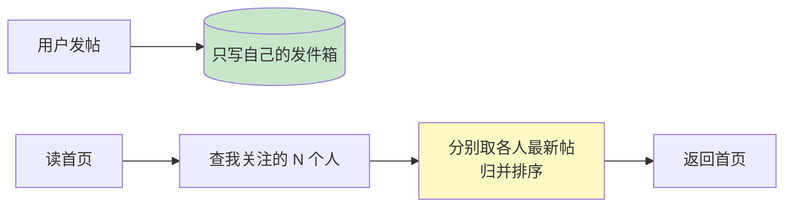
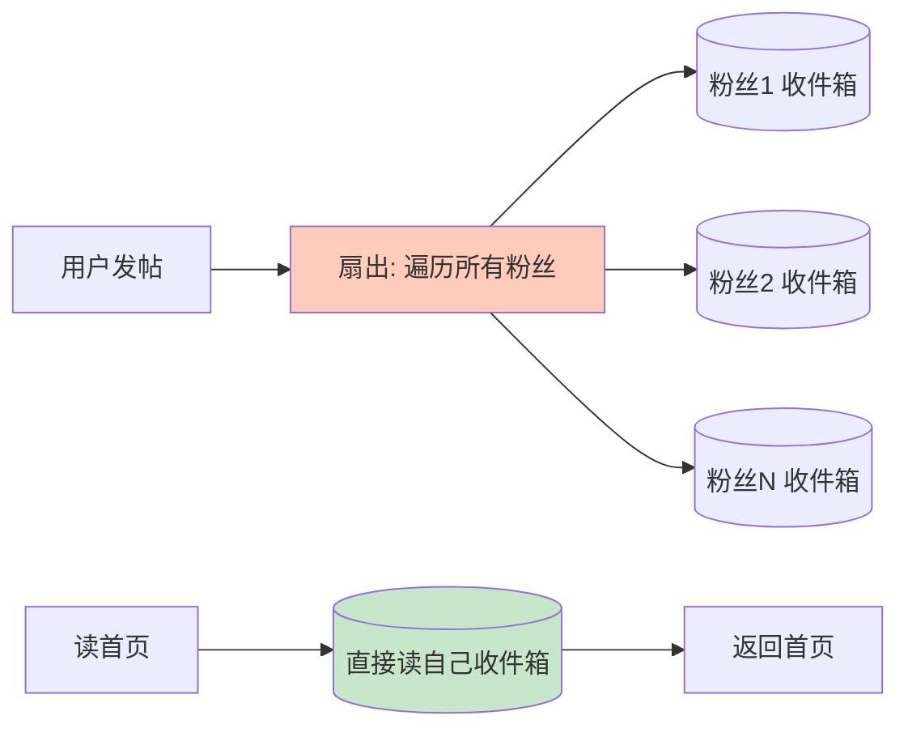
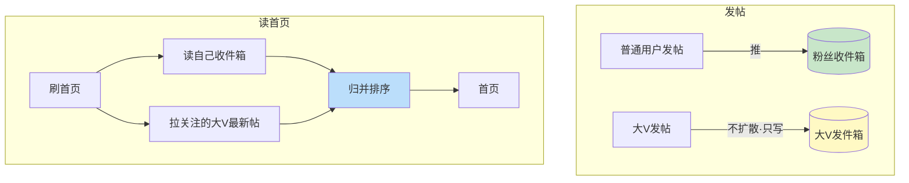

# 精通设计 Feed 流

> Feed 流（信息流/时间线）是社交产品的心脏——微博首页、朋友圈、抖音关注页都是 Feed。它的经典难点不在存储，而在**读写模式的选择**：推（写扩散）还是拉（读扩散）？这道题几乎必考，且答案是"看情况"。
>
> 本篇按 RESHADED 走，核心是讲清推、拉、推拉结合三种模式的权衡，以及"大 V 问题"这个绕不开的坎。

---

## 一、需求与规模

### 1.1 功能需求

- 用户关注其他用户；
- 发布动态（图文/视频）；
- **首页时间线**：聚合所看关注对象的最新动态，按时间/算法排序；
- 个人主页：某用户自己的动态列表。

### 1.2 非功能需求

- **读多写少**：刷 Feed 远多于发帖，读写比可达 100:1+。
- **低延迟**：刷新首页要快（p99 < 200ms）。
- **可接受最终一致**：发的帖晚几秒出现在粉丝首页可接受（非金融级强一致）。

### 1.3 容量估算

参照 [S02](./S02-精通-容量估算与必背数字.md)，假设 DAU 2 亿、人均发帖 0.1 次/天、刷 Feed 50 次/天：

- 写（发帖）QPS ≈ 2e8 × 0.1 / 1e5 = 200/s，峰值 ×5 ≈ 1000/s。
- 读 QPS ≈ 2e8 × 50 / 1e5 = 10万/s，峰值 ≈ 50万/s。
- **关注数分布是关键变量**：普通用户关注几百，大 V 粉丝可达千万——这个长尾分布决定了推/拉的成败。

**结论**：读 50万/s 是核心，必须预计算 + 缓存；而关注关系的极端不均（大 V）决定了不能用单一模式。

---

## 二、读扩散·拉模式（Pull）

**发帖时只写自己**（写进自己的发件箱 outbox）；**读时实时聚合**所有关注对象的最新动态，合并排序返回。

| 优点 | 缺点 |
|---|---|
| 写很轻（只写一份） | 读很重：每次读要查 N 个关注对象并归并 |
| 存储省（不冗余） | 关注数多时读延迟高（扇出查询） |
| 发帖即时可见、无扩散延迟 | 读放大严重，难扛高 QPS |

**适合**：关注数少、读频率不极端的场景；或作为大 V 内容的获取方式（见推拉结合）。

---

## 三、写扩散·推模式（Push）

**发帖时主动写入每个粉丝的收件箱**（inbox）；**读时直接读自己的收件箱**，无需聚合。

| 优点 | 缺点 |
|---|---|
| 读极快（直接读自己收件箱，已预计算好） | 写放大严重：一次发帖要写 N 个粉丝收件箱 |
| 适合读多写少 | 大 V 发帖→千万次写，瞬间风暴 |
| 收件箱可缓存在 Redis | 存储冗余（同一帖在很多收件箱有引用） |

**适合**：粉丝数可控的普通用户。**致命问题在大 V**（见下）。

---

## 四、推拉结合（混合模式·主流方案）

纯推死于大 V 写放大，纯拉死于普通用户读放大。**主流方案是按用户分类，混合使用**：

- **普通用户发帖 → 推**：写扩散到粉丝收件箱（粉丝少，写放大可接受，读快）。
- **大 V 发帖 → 拉**：只写自己发件箱，不扩散（避免千万次写）。
- **读首页时合并两路**：① 读自己收件箱（普通关注对象推来的）；② 实时拉取自己关注的大 V 的最新帖；③ 归并排序。

**判断阈值**：按粉丝数划线（如粉丝 > 10万 算大 V 走拉），或动态判断。这是工程上推拉结合的核心调参。

---

## 五、大 V 粉丝风暴问题

即使用推拉结合把"读时大 V 走拉"解决了，仍有**大 V 写扩散**的边界情况要处理（若某些活跃大 V 也想推给在线粉丝以求实时）：

- **异步分批扩散**：大 V 发帖不能同步写千万收件箱（会阻塞、超时）。改为发消息进 MQ，后台 worker 分批异步扩散，接受秒级延迟。
- **只推活跃粉丝**：千万粉丝里大部分是僵尸/不活跃。只给近期活跃的粉丝推，其余走拉。大幅降低扩散量。
- **扩散限流**：控制扩散速率，避免瞬间打爆收件箱存储。

核心思想：**大 V 的写放大用"异步 + 只推活跃 + 读时拉取"组合化解**，这是 Feed 系统最考验功力的地方。

---

## 六、时间线存储

- **收件箱/发件箱用 Redis**：每个用户一个有序结构（ZSet，score=时间戳或 feed_id），存的是 **feed_id 引用**而非完整内容（省内存）。读时按 id 批量取帖子正文（再走缓存）。
- **feed_id 设计**：趋势递增的 ID（如雪花，见 [M16 分布式 ID](../microservices/16-精通-分布式-ID.md)），便于按时间排序与游标分页。
- **游标分页（cursor）而非 offset**：用"上次最后一条的 feed_id"作游标向后翻，避免 offset 深分页的性能问题（与 [S12](./S12-精通-设计搜索与自动补全.md) 深分页同理）。
- **收件箱容量上限**：只保留最近 N 条（如 1000），超出截断，历史走拉/翻页回源。控制 Redis 内存（呼应 [S02](./S02-精通-容量估算与必背数字.md) 缓存估算）。

---

## 七、Feed 排序

- **时间序**：最简单，按 feed_id/时间倒序。微博/朋友圈早期模式。
- **算法推荐序**：按兴趣、互动率、时效等模型打分排序（抖音/推荐流）。这时 Feed 更像"召回 + 排序"的推荐系统，收件箱只是召回源之一。
- **去重**：同一帖经多路（收件箱 + 拉大 V）可能重复，按 feed_id 去重。
- **已读位置**：记录用户上次读到的位置（last_read_id），刷新时只返回更新部分、标记未读数。

---

## 八、读写放大与成本权衡

三种模式的本质是**把放大放在读侧还是写侧**：

| 模式 | 写放大 | 读放大 | 存储 | 适用 |
|---|---|---|---|---|
| 拉（读扩散） | 1（只写自己） | N（读时聚合 N 个关注） | 省 | 关注少、写多读少、大 V 内容获取 |
| 推（写扩散） | M（M 个粉丝） | 1（直接读收件箱） | 费（冗余） | 粉丝可控的普通用户、读多写少 |
| 推拉结合 | 普通 M / 大 V 1 | 收件箱 1 + 大 V 若干 | 中 | 关注分布极不均的真实社交 |

**面试要点**：不要直接说"用推"或"用拉"，而要先问关注数分布、读写比，再说"普通用户推、大 V 拉的混合方案，因为……"。这正是 [S01 方法论](./S01-精通-系统设计面试方法论.md) 强调的"讲权衡"。

---

## 陷阱清单

- **纯推不管大 V**：大 V 发帖写千万收件箱，瞬间风暴、超时、存储爆炸。
- **纯拉不管关注多的用户**：读时聚合上百关注对象，读延迟高、扛不住高 QPS。
- **同步扩散**：大 V 发帖同步写所有粉丝，请求阻塞。必须异步分批。
- **收件箱存完整内容**：内存爆炸。应存 feed_id 引用，正文另取。
- **offset 深分页**：翻到很后面性能急剧下降。用 feed_id 游标分页。
- **不给收件箱设上限**：无限增长撑爆 Redis。保留最近 N 条。
- **多路不去重**：推 + 拉合并后同一帖重复出现。按 feed_id 去重。
- **给僵尸粉也推**：大量扩散浪费在不活跃用户上。只推活跃粉丝。

---

## 2026 现状

- **推荐流成主流**：纯时间序 Feed 让位于算法推荐流（抖音、小红书），Feed 系统与推荐召回/排序深度融合，收件箱成为召回源之一。
- **Redis 8.0 / Valkey** 仍是时间线收件箱的主力存储，见 [redis 专题](../redis/INDEX.md)。
- **流式扩散**：用 Kafka/Flink 做大 V 扩散与实时计算，扩散 + 排序特征一体化，见 [kafka 专题](../kafka/INDEX.md)。
- **存储下沉**：超大规模平台用专门的时间线存储（如基于 LSM 的 KV），收件箱不全放内存，热数据 Redis、温数据落盘。
- **AI 个性化**：大模型做兴趣理解与内容理解，召回更精准，"关注 Feed"与"推荐 Feed"边界模糊。

---

## 练习题

1. 对比 Feed 的推模式（写扩散）和拉模式（读扩散），分别说明写放大、读放大、存储成本，以及各自适合什么场景。

参考答案

推（写扩散）：发帖时写入每个粉丝收件箱，写放大 = 粉丝数 M（大 V 极高），读放大 = 1（直接读自己收件箱，已预计算），存储冗余高（同一帖在很多收件箱有引用）。适合粉丝数可控的普通用户、读多写少场景，读体验最好。拉（读扩散）：发帖只写自己，写放大 = 1，读放大 = N（读时聚合 N 个关注对象并归并），存储省。适合关注数少、或用于获取大 V 内容。本质区别是把放大放在写侧还是读侧；现实社交关注分布极不均，所以单一模式都不行。

2. 什么是"大 V 问题"？为什么纯推模式在大 V 场景下会崩溃？推拉结合如何解决？

参考答案

大 V 问题：少数账号拥有千万级粉丝，关注关系极度不均衡。纯推模式下，大 V 一次发帖要同步写入千万个粉丝的收件箱，造成瞬间写风暴——写入耗时极长、可能超时、存储瞬间暴涨，系统崩溃。推拉结合的解法：把用户分类，普通用户发帖走推（粉丝少，写放大可接受），大 V 发帖走拉（只写自己的发件箱，不扩散）；用户读首页时，一路读自己的收件箱（普通关注推来的），另一路实时拉取自己关注的大 V 的最新帖，再归并排序。这样既避免大 V 的写放大，又保证普通内容的读性能。

3. 大 V 即使走拉，若仍想给在线粉丝实时推送，写扩散量巨大。有哪些手段降低扩散成本？

参考答案

①**异步分批扩散**：发帖发消息进 MQ，后台 worker 分批写收件箱，接受秒级延迟，不阻塞发帖；②**只推活跃粉丝**：千万粉丝中大部分不活跃，只给近期登录/活跃的粉丝推，其余靠读时拉取，扩散量可降一两个数量级；③**扩散限流/削峰**：控制扩散速率，避免瞬间打爆存储；④**分级**：核心活跃粉丝实时推，长尾粉丝延迟推或纯拉。核心是用"异步 + 只推活跃 + 读时兜底拉取"把写放大摊薄。

4. 时间线收件箱为什么存 feed_id 而不是完整帖子内容？为什么用游标分页而不是 offset 分页？

参考答案

存 feed_id 引用而非完整内容：①省内存——同一帖被很多收件箱引用，若每份都存完整内容会成倍冗余撑爆 Redis；②正文可单独缓存/更新，帖子被编辑或删除时不必改所有收件箱。读时按 id 批量取正文（再走缓存）。游标分页（用上次最后一条 feed_id 作游标向后取）优于 offset：offset 深分页要扫描并跳过前面 N 条，越往后越慢（O(N)），而游标基于有序 feed_id 直接定位，翻页性能恒定；且 Feed 持续有新内容插入，offset 会导致重复/遗漏，游标基于稳定 id 不受影响。

5. 给定一个社交产品，用户关注数中位数 200、最大 5000 万粉丝，读写比 100:1。设计 Feed 方案并说明判断阈值。

参考答案

读写比 100:1（读多写少）整体倾向写扩散（推）以优化读。但最大 5000 万粉丝的大 V 不能推。方案：推拉结合。设一个粉丝数阈值（如 10 万）：粉丝数 < 阈值的普通用户发帖走推（写扩散到粉丝收件箱，中位数 200 粉丝写放大很小）；粉丝数 ≥ 阈值的大 V 走拉（只写发件箱）。读首页 = 读自己收件箱 + 实时拉取所关注大 V 的最新帖 + 归并去重排序。阈值可根据"扩散成本"动态调整（写放大 × 发帖频率），并对大 V 的活跃粉丝做异步增量推以兼顾实时性。收件箱用 Redis ZSet 存 feed_id、限长 1000、游标分页。

6. 推拉结合读首页时，同一条帖子可能从收件箱和拉取两路都出现，如何处理？

参考答案

按 **feed_id 去重**。归并两路结果时，用 feed_id 作为唯一标识放入 set/map 去重，同一 feed_id 只保留一条。通常的实现：先合并两路候选，按 feed_id 去重，再按时间或算法分排序，截取一页返回。去重必须基于稳定唯一的 feed_id（而非内容或位置），因为推来的引用和拉来的原帖指向同一条。此外要注意排序稳定性和分页游标的一致性，避免去重后页与页之间出现重复或跳漏。

7. 为什么 Feed 系统适合"最终一致"而不需要强一致？这个选择带来什么好处？

参考答案

因为 Feed 的业务语义能容忍延迟：用户发的帖晚几秒出现在粉丝首页、点赞数短暂不精确，都不影响核心体验，也不涉及金钱/库存等不可逆后果。选择最终一致的好处：①可以异步扩散（大 V 发帖后台慢慢推），避免同步写放大阻塞；②可以大量使用缓存/预计算的收件箱而不必实时强同步；③在多副本/多机房下无需跨节点强一致协调，获得更高可用性和更低延迟（CAP 中偏向 AP）。这正是"按业务选一致性级别"的体现——把强一致的成本省下来换性能和可用性，见 S04 / B12。

