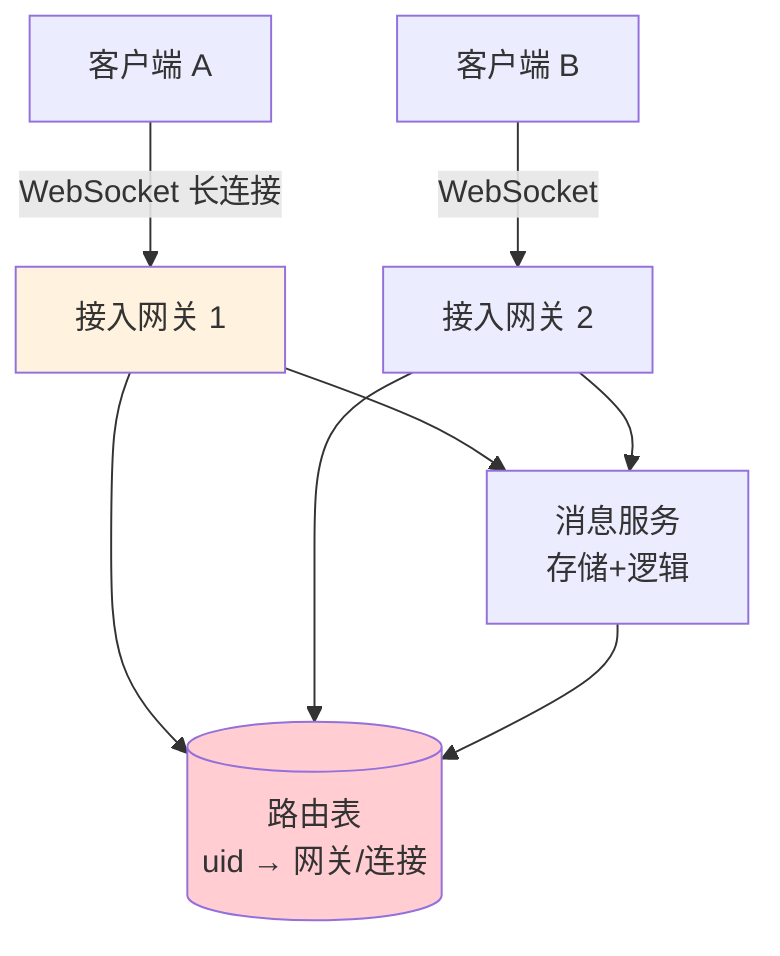
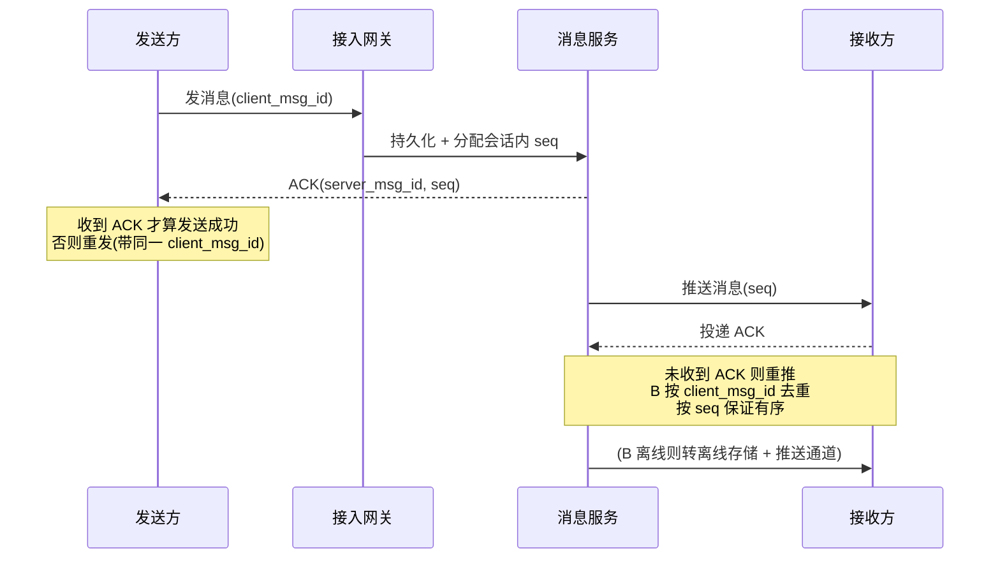

# 精通设计 IM 即时通讯

> IM（即时通讯）是长连接系统的代表作——微信、钉钉、客服系统都是 IM。它和前面的 HTTP 短请求系统完全不同，难点集中在：**长连接接入、消息的可靠投递（不丢、不重、有序）、在线状态、群消息扩散**。
>
> 本篇按 RESHADED 走，重点讲清"一条消息如何保证一定送达且只送达一次且顺序正确"这个 IM 的灵魂问题。

---

## 一、需求与核心难点

### 1.1 功能需求

- 单聊、群聊；
- 在线状态（在线/离线/正在输入）；
- 消息送达 + 已读回执；
- 离线消息（不在线时收到的消息，上线后补齐）。

### 1.2 核心难点

| 难点 | 说明 |
|---|---|
| **实时** | 消息要秒级甚至更快送达，靠长连接主动推送 |
| **可靠不丢** | 网络抖动、宕机不能丢消息 |
| **不重复** | 重试机制下消息可能重复，要去重 |
| **有序** | 消息顺序不能乱（"在吗"要在"借钱"前面） |
| **海量长连接** | 亿级用户在线，连接管理是硬骨头 |

### 1.3 容量估算

参照 [S02](./S02-精通-容量估算与必背数字.md)：假设 1 亿在线用户、人均每天收发 40 条消息：

- 消息写 QPS ≈ 1e8 × 40 / 1e5 = **4万/s**，峰值 ×5 ≈ 20万/s。
- 同时在线长连接 **1 亿**：单机长连接按 50万-100万估，需 **100-200 台**接入网关。

**结论**：长连接数量决定接入层规模；消息可靠投递 + 有序是核心设计。

---

## 二、长连接接入层

IM 用**长连接**（WebSocket / 自定义 TCP 协议）让服务端能主动推消息给客户端。

- **接入网关**专职维护海量长连接（epoll/io_uring 支撑，见 [L08 IO 多路复用](../linux/L08-精通-IO-多路复用.md)），与业务逻辑分离。
- **路由表 uid→网关**：A 给 B 发消息，系统要知道"B 的长连接挂在哪台网关"。维护 `uid → gateway_id/conn_id` 映射（存 Redis），推送时先查路由、再投递到对应网关、由网关推给客户端。
- **网关水平扩展**：连接是有状态的（绑在某台网关），靠路由表解耦"谁在哪"。网关重启/扩缩要处理客户端重连（见 [S03 长连接接入](./S03-精通-接入层与水平扩展.md)）。

---

## 三、在线状态管理

- **心跳保活**：客户端定期发心跳，网关据此判断连接是否存活；超时未心跳则判定离线、清理连接与路由。
- **状态存储**：用户在线状态（在线/离线 + 所在网关）存 Redis，供推送时查询。
- **状态变更通知**：上下线事件可通知关心的人（如好友看到"对方在线"），但海量场景要控制通知放大（类似 [S08 Feed](./S08-精通-设计Feed流.md) 的扩散问题），常做弱实时或按需查询。

---

## 四、消息可靠投递

**这是 IM 的灵魂。** 目标：不丢、不重、有序。三个机制组合：

### 4.1 不丢：持久化 + ACK + 重传

- 消息先**持久化**再确认。发送方收到 server 的 ACK 才认为发成功，否则重发。
- 服务端推给接收方后，要收到接收方的**投递 ACK**；未收到则重推。
- 这是端到端的可靠投递，类似 TCP 的确认重传思想（见 [L12 TCP](../linux/L12-精通-TCP-IP-内核实现与调优.md)）。

### 4.2 不重：client_msg_id 去重

- 发送方为每条消息生成唯一 `client_msg_id`。重发用同一个 id。
- 服务端/接收端按 `client_msg_id` 去重，重复消息只处理一次（幂等，见 [S05](./S05-精通-缓存与异步化设计.md)）。

### 4.3 有序：会话内 seq

- 服务端为每个会话分配**单调递增的 seq**（序列号）。
- 接收端按 seq 排序展示，发现 seq 跳号（缺消息）则主动拉取补齐。
- **有序只需保证"会话内"**，不同会话间无需全局有序——这大大降低了实现难度。

---

## 五、单聊消息存储

两种存储模型（与 [S08 Feed](./S08-精通-设计Feed流.md) 推拉异曲同工）：

- **写扩散（收件箱模型）**：消息写入收件人的收件箱。读快，但群聊写放大大。
- **读扩散（会话模型）**：消息按会话存一份，读时按会话拉取。存储省，单聊常用。

单聊通常用**会话维度存储**：会话 ID（由双方 uid 生成，保证同一对话唯一）+ seq 组织消息，双方共享一条消息流。离线方设"同步点"，上线后从同步点拉取未读。

---

## 六、群聊扩散

群聊是 IM 的扩散难点（类似大 V 问题）：

- **小群（写扩散）**：消息写入每个成员的收件箱/同步队列，成员读自己的即可。成员少，写放大可接受。
- **大群（读扩散）**：万人群若写扩散，一条消息写一万份，风暴。改为**消息只存一份（群会话），成员读时拉取 + 维护各自的已读 seq**。
- **在线成员实时推、离线成员拉**：在线的直接推送，离线的上线后按群会话同步点拉取。

核心：**大群用"存一份 + 读扩散 + 各自 seq"，避免写放大**。这与 Feed 大 V 的处理思路一致。

---

## 七、已读回执与未读数

- **未读数**：每个会话维护用户的"已读 seq"，未读数 = 最新 seq − 已读 seq。
- **已读回执**：用户读到某条，上报已读 seq；发送方/群里据此显示"已读"。
- **大群已读**：万人群逐个显示已读不现实，通常只统计已读人数或对大群关闭已读，避免回执风暴。

---

## 八、离线消息与第三方推送

- **离线消息存储**：接收方不在线时，消息存入其离线队列/会话同步点。上线后按同步点增量拉取，拉完更新同步点。
- **第三方推送通道**：App 被杀进程、长连接断开时，靠操作系统推送通道送达（iOS APNs、Android FCM/厂商通道如华米 OV）。这是长连接之外的兜底送达。
- **多端同步**：用户多设备登录，每端维护各自的同步点，消息要同步到所有在线端，已读状态多端一致。

---

## 陷阱清单

- **不持久化就 ACK**：消息还没存就确认，服务宕机即丢。必须先持久化再 ACK。
- **无去重**：重传导致消息重复显示。必须用 client_msg_id 去重。
- **追求全局有序**：试图让所有消息全局有序，复杂且无必要。只需会话内有序。
- **群聊一律写扩散**：万人群写扩散造成风暴。大群用读扩散 + 各自 seq。
- **路由表不更新**：用户重连到新网关但路由没更新，消息推到旧网关丢失。要及时更新 uid→网关。
- **心跳过松/过紧**：过松发现离线慢、僵尸连接占资源；过紧浪费电量和带宽。要权衡。
- **只靠长连接送达**：App 被杀就收不到。必须配第三方推送兜底。
- **大群已读回执风暴**：万人群每人已读都通知，回执量爆炸。大群关闭或聚合已读。

---

## 2026 现状

- **WebSocket over QUIC / HTTP/3**：基于 UDP 的连接迁移让移动端切换网络（WiFi↔5G）不断连，弱网体验提升，见 [S03](./S03-精通-接入层与水平扩展.md)。
- **海量长连接网关**：基于 Go/Rust + epoll/io_uring 的网关单机可维持百万连接，配合云原生弹性扩缩，见 [L09 io_uring](../linux/L09-精通-io_uring-与异步IO.md)。
- **端到端加密（E2EE）**：Signal 协议等成为隐私 IM 标配，服务端只转发密文，影响已读/搜索等服务端功能的设计。
- **存储分层**：消息热数据 Redis/内存、温冷数据落 LSM KV（如基于 RocksDB），按会话 + seq 组织。
- **统一推送**：国内厂商推送联盟、跨厂商通道整合，提升离线送达率。

---

## 练习题

1. IM 如何同时保证消息"不丢、不重、有序"？分别用什么机制？

参考答案

**不丢**：消息先持久化再返回 ACK，发送方收到 ACK 才算成功、否则重发；服务端推给接收方后需收到接收方的投递 ACK，未收到则重推——端到端确认 + 重传（类似 TCP）。**不重**：发送方为每条消息生成唯一 client_msg_id，重发沿用同一 id，服务端/接收端按 client_msg_id 去重，保证幂等。**有序**：服务端为每个会话分配单调递增的 seq，接收端按 seq 排序，发现跳号则主动拉取补齐。关键认知：有序只需保证"会话内"，不要求跨会话全局有序，否则复杂度和成本剧增。

2. 为什么消息有序只需要"会话内有序"而不需要全局有序？后者有什么代价？

参考答案

因为用户感知的顺序是在单个会话（单聊或单个群）内的——只要同一对话里消息按发送顺序展示就符合直觉；不同会话之间谁先谁后无意义。所以只需为每个会话维护独立的递增 seq 即可。若追求全局有序（所有会话所有消息一个全局序列），需要一个全局单调序列发生器，所有消息写入都要经过它，成为单点瓶颈和扩展障碍，且跨分片协调代价极高；而它带来的"全局顺序"对用户毫无价值。因此会话内有序是正确的设计取舍。

3. 用户 A 给 B 发消息，系统如何知道把消息推到哪台接入网关？这个路由如何维护？

参考答案

维护一张 `uid → 网关ID/连接ID` 的路由表（存 Redis）。B 建立长连接时，接入网关把"B 在本网关、连接 X"写入路由表；心跳维持，断开/超时则清除。A 发消息时，消息服务查路由表得知 B 所在网关，把消息投递给该网关，网关再通过对应长连接推给 B。维护要点：①连接建立/断开/重连时及时更新路由（否则消息推到错误或失效的网关而丢失）；②网关宕机时批量清理其上所有路由；③B 多端登录则一个 uid 对应多条连接记录，需都推送。路由表是长连接系统"找人"的核心。

4. 万人大群如果用写扩散会发生什么？正确的做法是什么？

参考答案

写扩散下，群里一条消息要写入一万个成员的收件箱/同步队列，一次发言产生一万次写，活跃大群消息频繁时造成巨大的写放大和存储冗余，瞬间打爆存储、延迟飙升。正确做法是**读扩散**：消息只在群会话里存一份，每个成员维护自己的"已读 seq"；在线成员实时推送，离线成员上线后从群会话的同步点按 seq 增量拉取。这样写入只有一份，读取按需进行，避免写放大。这与 Feed 的大 V 用拉模式是同一思路：扩散成本太高时，改为存一份 + 读时拉取 + 各自维护进度。

5. 长连接断开（如 App 被系统杀死）时，如何保证消息仍能送达用户？

参考答案

①**离线消息存储**：用户不在线时，消息存入其离线队列/会话同步点，待其重新上线后按同步点增量拉取补齐，保证不丢。②**第三方推送通道兜底**：长连接断开/App 被杀时，通过操作系统级推送送达——iOS 走 APNs，Android 走 FCM 或国内厂商通道（华为/小米/OPPO/VIVO），让用户在通知栏看到新消息并唤起 App。③ App 重新启动后重建长连接并同步离线消息。即"长连接实时推 + 离线存储 + 系统推送"三层保证送达，长连接不是唯一通道。

6. 设计在线状态（在线/离线）的维护机制，并说明海量用户下状态变更通知的难点。

参考答案

机制：客户端通过长连接定期发心跳，接入网关据心跳判断连接存活，并把"用户在线 + 所在网关"写入 Redis（带过期），心跳续期；超时未心跳或连接断开则判定离线、清除状态和路由。查询某用户在线状态时读 Redis 即可。海量难点：状态变更（上下线）若要实时通知所有关心者（如好友列表），会产生扩散放大——一个高频上下线用户或拥有大量好友的用户，会引发大量通知，类似 Feed 大 V 问题。对策：弱实时（好友打开页面时按需查询状态而非实时推）、聚合/限频通知、只对活跃会话推送状态、对超大关系链放弃实时在线展示。

7. client_msg_id 和服务端 seq 各自的作用是什么？为什么需要两个 ID？

参考答案

**client_msg_id**：由发送方客户端生成的全局唯一 id，作用是**去重/幂等**——重发同一条消息时沿用同一 client_msg_id，服务端和接收端据此识别重复、只处理一次；它也用于发送方匹配自己发出的消息与服务端返回的 ACK。**server seq**：由服务端为每个会话分配的单调递增序列号，作用是**排序与补齐**——接收端按 seq 排序展示、检测跳号缺失并拉取补齐。需要两个的原因：client_msg_id 在消息进入服务端之前就要存在（发送阶段的去重和重发匹配，客户端无法预知服务端 seq），而 seq 必须由服务端统一分配才能保证会话内顺序一致（多个客户端发的消息要有统一顺序）。一个解决"去重"，一个解决"有序"，职责不同、生成方不同，缺一不可。

