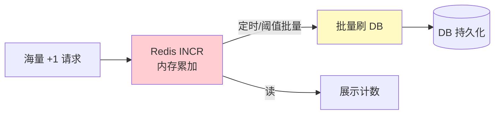
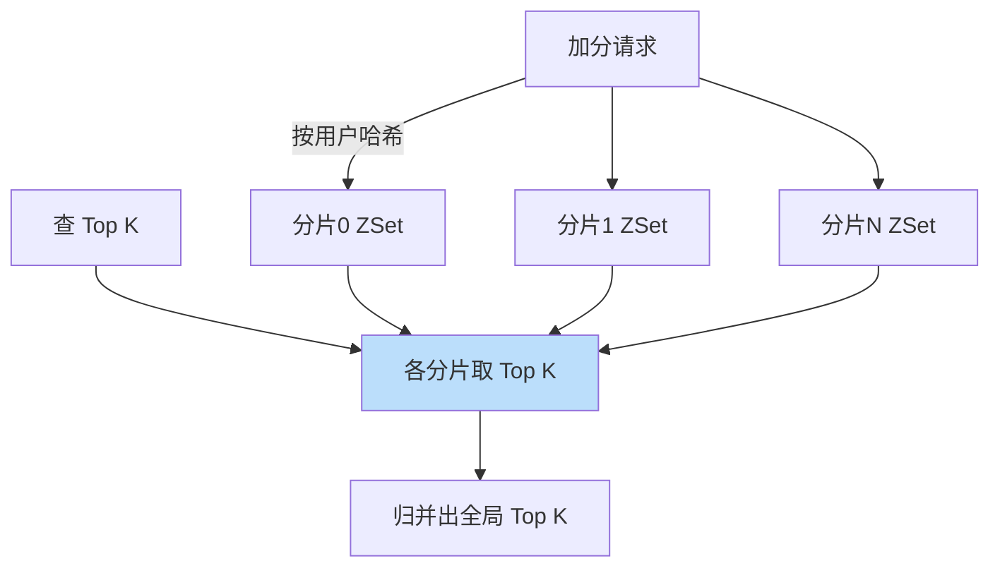

# 精通设计排行榜与计数系统

> 排行榜（游戏榜、热搜榜、直播榜）和计数（点赞数、播放量、阅读数）是几乎每个产品都有的功能。它们看似简单，但在**海量、高并发、实时**三个约束下，朴素实现会瞬间崩溃。这道题考的是对 Redis 数据结构和"写聚合"思想的掌握。
>
> 本篇按 RESHADED 走，重点：Redis ZSet 做实时榜、海量计数的写聚合、超大规模的分片归并。

---

## 一、需求与规模

### 1.1 功能需求

- **排行榜**：按分数（积分/热度/销量）实时排序，取 Top N，查某用户排名。
- **计数**：海量对象的点赞/播放/阅读数，高频自增、读取展示。

### 1.2 非功能需求

- **实时/近实时**：榜单和计数要尽量及时更新。
- **高并发写**：爆款内容点赞/播放可达每秒数万甚至更高。
- **可接受最终一致**：计数短暂不精确可接受（点赞数差几个无伤大雅）。

### 1.3 容量估算

参照 [S02](./S02-精通-容量估算与必背数字.md)：假设热门视频峰值 10万/s 的播放计数写入。单 MySQL 写仅几千 TPS——**直接每次播放 UPDATE 一行计数，DB 必然被打爆**。这就是为什么需要写聚合。

---

## 二、Redis ZSet 实时排行榜

排行榜的本质是"按分数排序的集合"，**Redis ZSet（有序集合）天生为此而生**：

```
ZADD rank:game 1500 "userA"      # 设置/更新分数
ZINCRBY rank:game 100 "userA"    # 加分
ZREVRANGE rank:game 0 9 WITHSCORES   # Top 10（分数倒序）
ZREVRANK rank:game "userA"       # 查 userA 的排名
```

| 操作 | 命令 | 复杂度 |
|---|---|---|
| 更新分数 | ZADD / ZINCRBY | O(log N) |
| Top N | ZREVRANGE | O(log N + M) |
| 查排名 | ZREVRANK | O(log N) |
| 区间排名 | ZREVRANGE | O(log N + M) |

ZSet 底层是跳表 + 哈希（见 [redis 数据结构](../redis/01-精通-Redis-数据结构内部.md)），更新和查询都是对数级，单实例可支撑十万级 QPS。

### 2.1 同分排序

分数相同时 ZSet 按 member 字典序排，可能不符合业务（如"先到先得"）。技巧：把**时间戳编码进分数**——`score = 实际分数 * 1e10 + (最大时间戳 - 提交时间戳)`，让同分者按时间先后稳定排序。

---

## 三、海量计数设计

爆款点赞/播放每秒数万写，**绝不能每次直接 `UPDATE count = count + 1`**（DB/单 key 都扛不住）。核心思想：**写聚合**——把大量小写合并成少量批量写。



三种聚合手段：

| 手段 | 做法 | 适用 |
|---|---|---|
| Redis 内存累加 | `INCR` 在 Redis 计数，定时批量回写 DB | 通用，最常用 |
| 本地累加再刷 | 应用实例本地累加 N 次或 T 秒，再批量提交 | 极高频，进一步削减 Redis 压力 |
| 计数器分片 | 把单 key 拆成多个分片 key，求和读取 | 单个超级热点（如顶流） |

### 3.1 计数器分片（破解单 key 热点）

顶流内容的计数 key 是超级热点，单 key 写入串行成瓶颈（同 [S07 秒杀](./S07-精通-设计秒杀系统.md) 库存分桶）：

```
like:video123:shard0, like:video123:shard1, ... like:video123:shard9
写：随机选一个分片 INCR
读：SUM(所有分片)
```

写分散到 10 个 key，吞吐近 10 倍；读时求和（10 次读，可缓存）。

---

## 四、近实时榜单

实时全量榜代价高，很多榜单（小时榜、日榜、热搜）做**近实时**即可：

- **分桶 + 定时聚合**：原始行为（播放/点赞）先写流水/Redis 计数，定时任务（如每分钟）聚合出 Top N 榜单快照，读榜读快照。
- **多时间维度**：小时榜、日榜、周榜、总榜分别维护。可用带时间窗的 ZSet 或定时滚动。
- **冷启动 / 衰减**：热度榜常加时间衰减因子（老内容热度随时间下降），避免榜单僵化。

近实时用"**写流水 + 定时聚合快照**"换取系统可承受性，牺牲秒级精确——典型的 [S05 异步化](./S05-精通-缓存与异步化设计.md) 思想。

---

## 五、持久化与重建

Redis 是内存存储，排行榜/计数不能只活在 Redis：

- **定期落库**：ZSet/计数定时快照到 DB，防 Redis 故障丢失。
- **故障重建**：Redis 挂了，从 DB 快照 + 重放近期流水（如 Kafka 里的行为日志）重建榜单/计数。
- **DB 为最终真相**：Redis 是加速层，DB（或流水）是可重建的源头——和 [S07](./S07-精通-设计秒杀系统.md) 的"DB 为最终真相"一致。

---

## 六、防刷与去重

- **计数防刷**：同一用户重复点赞只算一次——用 set 记录已点赞用户（`SADD like:video123:users uid`，SADD 返回 1 才 INCR），或限频。
- **UV 去重用 HyperLogLog**：统计独立访客数（UV），精确 set 太占内存。用 HLL（`PFADD`/`PFCOUNT`）以极小内存（~12KB）估算亿级基数，误差 ~0.81%——典型的"用精度换内存"。
- **刷榜对抗**：识别异常加分（机器人/作弊），风控过滤。

---

## 七、超大规模·分片榜单与合并

单 ZSet 装不下/扛不住超大规模（如全球亿级玩家总榜）时，**分片 + 归并**：



**关键正确性**：要取全局 Top K，必须**每个分片各取 Top K** 再归并（不能每片只取 Top K/N）——因为全局前 K 名可能集中在某一个分片。各片取 K 个，归并后取前 K，才保证正确。这是分布式 Top-K 的经典考点。

实时精确全局排名在分片下很难（要扫所有片），所以超大榜常做**近似排名**（如分段统计"你超过了 80% 的人"）或只精确维护 Top N。

---

## 陷阱清单

- **每次计数直接写 DB**：海量自增打爆 DB。必须 Redis 累加 + 批量刷库。
- **单 key 抗超级热点**：顶流计数单 key 串行瓶颈。用计数器分片。
- **UV 用精确 set**：亿级用户 set 占内存巨大。用 HyperLogLog 估算。
- **分片 Top-K 各片只取 K/N**：会漏掉集中在某片的高分者。每片必须取 Top K 再归并。
- **只在 Redis 不持久化**：Redis 宕机榜单/计数全丢。定期落库 + 可重放流水重建。
- **同分排序不稳定**：同分按字典序不符业务。把时间编码进分数。
- **追求绝对实时全量榜**：代价过高。多数榜近实时（定时聚合快照）即可。
- **不防刷**：点赞/榜单被机器人刷爆。去重 + 限频 + 风控。

---

## 2026 现状

- **Redis 8.0 / Valkey** 的 ZSet 仍是实时排行榜事实标准；HyperLogLog 仍是海量 UV 去重首选，见 [redis 专题](../redis/INDEX.md)。
- **流式聚合**：Flink/Kafka Streams 做实时计数与窗口榜单（滑动窗口热搜榜），写聚合 + 时间窗一体化，见 [kafka 专题](../kafka/INDEX.md)。
- **OLAP 做多维榜单**：ClickHouse/Doris 实时聚合海量行为，支持按地域/品类等多维度即时出榜。
- **概率数据结构普及**：除 HLL，Count-Min Sketch、Top-K（Redis Bloom 模块）等用于近似频次/热点统计，省内存。
- **本地累加 + 边缘计数**：超高频计数在应用层/边缘预聚合后再上报，进一步削减中心压力。

---

## 练习题

1. 为什么 Redis ZSet 适合做排行榜？列出更新分数、取 Top N、查排名的命令和复杂度。

<details><summary>参考答案</summary>

ZSet（有序集合）底层是跳表 + 哈希表，元素按 score 有序组织，天然支持"按分数排序"这一排行榜核心需求，且增删改查都是对数级、单实例可支撑十万级 QPS。命令与复杂度：更新分数 `ZADD key score member` 或 `ZINCRBY key delta member`，O(log N)；取 Top N（分数倒序）`ZREVRANGE key 0 N-1 WITHSCORES`，O(log N + M)；查某成员排名 `ZREVRANK key member`，O(log N)；查区间 `ZREVRANGE`，O(log N + M)。相比关系库的 `ORDER BY ... LIMIT`（需扫描/排序，高并发下慢），ZSet 在内存中维护有序结构，实时榜性能远胜。

</details>

2. 一个爆款视频每秒 10 万次播放，为什么不能每次都 `UPDATE count=count+1`？正确做法是什么？

<details><summary>参考答案</summary>

因为单 MySQL 写仅几千 TPS，10 万/s 的 UPDATE 会瞬间打爆 DB；而且对同一行的并发 UPDATE 会产生激烈的行锁竞争，吞吐进一步下降。正确做法是**写聚合**：播放计数先在 Redis 用 INCR 内存累加（Redis 十万级 QPS 可承受），再由定时任务/达到阈值时把累加值批量回写 DB（如每秒/每攒够 N 次刷一次），把海量小写合并成少量批量写。读展示直接读 Redis。若单个 key 仍是超级热点，进一步做计数器分片（拆成多个 key 分散写、读时求和）。这样 DB 只承受聚合后的少量写，Redis 承受高并发自增。

</details>

3. 如何用最小内存统计一个亿级访问内容的独立访客数（UV）？精度如何？

<details><summary>参考答案</summary>

用 **HyperLogLog（HLL）**：`PFADD key uid` 添加访客，`PFCOUNT key` 估算基数。HLL 是概率基数估算结构，无论加入多少元素，单个 HLL 仅占约 12KB 内存，就能估算亿级独立数，标准误差约 0.81%。相比精确 set（亿级 uid 要几 GB 内存），HLL 以极小内存换取可接受的精度损失，非常适合 UV 这种"不需要绝对精确、量级巨大"的去重统计。若需要精确去重（如防重复点赞）则仍用 set，但那是小基数场景。这是"用精度换内存"的经典取舍。

</details>

4. 分布式 Top-K：数据分了 10 片，要取全局 Top 100。为什么每片只取 Top 10 是错的？正确怎么做？

<details><summary>参考答案</summary>

每片只取 Top 10（即 K/片数）是错的，因为全局前 100 名可能高度集中在某一两个分片——极端情况下全球前 100 全在分片 0，那么只从分片 0 取 10 个就漏掉了 90 个真正的高分者。正确做法是**每个分片各取 Top K（100）**，得到 10×100=1000 个候选，再归并这 1000 个、排序取前 100，即为全局 Top 100。因为任何一个全局前 100 的成员，在其所属分片内排名必然 ≤100，所以一定会被该片的 Top 100 包含，归并不会遗漏。代价是要从每片取 K 个、归并 K×片数 个候选，但这是保证正确性的必要开销。

</details>

5. 排行榜数据只存在 Redis 有什么风险？如何做持久化和故障重建？

<details><summary>参考答案</summary>

风险：Redis 是内存存储，宕机或重启（若持久化不全）会导致榜单/计数数据丢失，且单纯依赖 Redis 持久化（RDB/AOF）在极端故障下仍可能丢最近数据。做法：①**定期落库**——定时把 ZSet/计数快照写入 DB；②**保留可重放的流水**——把加分/计数等原始行为写入 Kafka 等日志，作为可重放的真相源；③**故障重建**——Redis 挂掉后，从 DB 最近快照恢复，再重放快照之后的流水补齐增量，重建榜单/计数。核心原则同秒杀：Redis 是加速层，DB/流水是最终真相和重建依据，二者配合保证既快又不丢。

</details>

6. 同分数的排行如何保证稳定且符合业务（如先达到者排前）？

<details><summary>参考答案</summary>

ZSet 在 score 相同时按 member 的字典序排列，这通常不符合业务期望（如希望先达到该分数的人排前面）。技巧是把**时间因素编码进 score**：用一个复合分数，例如 `score = 真实分数 * C + (MAX_TS - 达到时间戳)`，其中 C 是足够大的常数保证真实分数占主导，达到时间越早 `(MAX_TS - 达到时间戳)` 越大、复合分越高，从而同真实分下先达到者排前；或反之按需要。这样既保持按真实分数排序，又用时间戳打破同分平局、保证稳定且符合业务语义。注意 C 要大于时间戳部分的最大可能值，避免时间影响跨越真实分差。

</details>

7. 小时热搜榜要求近实时更新，如何设计才能既及时又不压垮系统？

<details><summary>参考答案</summary>

不做"每次行为都实时全量重排"（代价高），而用**写流水 + 定时聚合快照**：①用户搜索/点击等行为先快速写入流水（Kafka）或在 Redis 累加各关键词的计数；②定时任务（如每分钟，或用 Flink 滑动窗口）聚合最近一小时窗口内各关键词的热度，计算出 Top N 生成榜单快照；③前端读榜直接读这个快照（缓存），不触发实时计算。再叠加时间衰减因子让旧热点降权。这样把高频写转成低频聚合，读榜是 O(1) 读快照，系统压力可控，更新延迟为聚合周期（分钟级近实时），在"及时"和"可承受"间取得平衡——本质是 S05 的异步化/最终一致思想。

</details>
