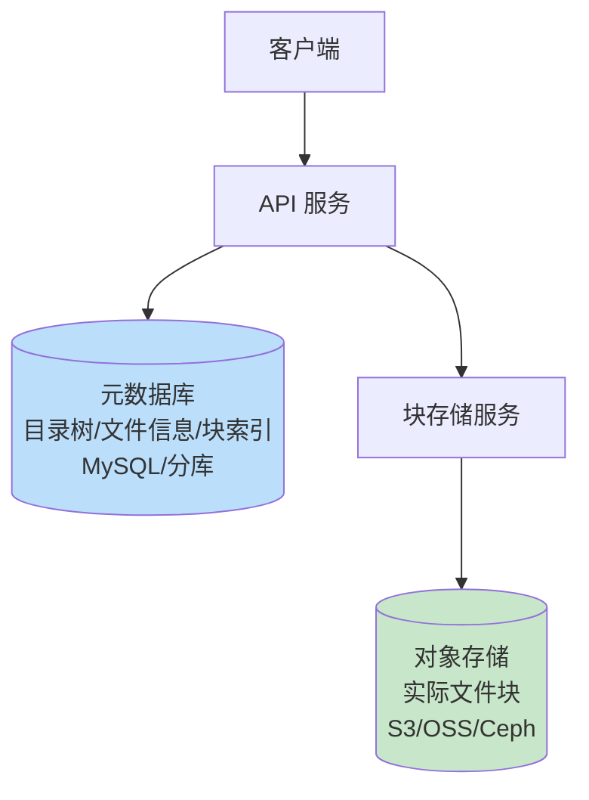
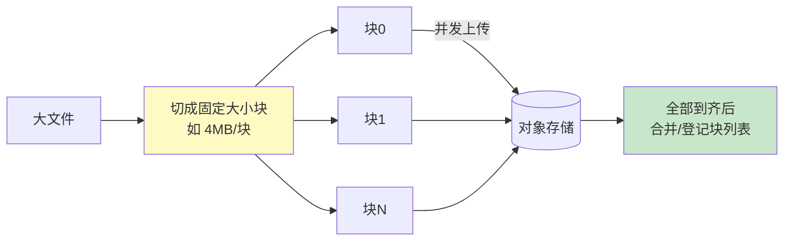
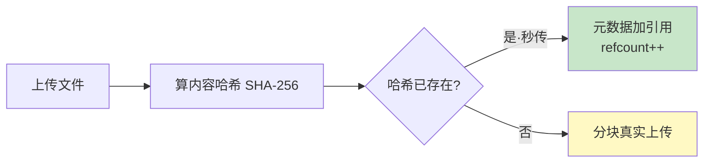

# 精通设计网盘与对象存储

> 网盘（百度网盘、Dropbox、Google Drive）和它底层的对象存储，是"海量文件 + 大文件 + 去重"的代表题。它的精彩之处在于几个反直觉的设计：**元数据与数据分离**、**秒传（内容寻址去重）**、**分块上传与断点续传**。
>
> 本篇按 RESHADED 走，重点讲清这几个核心机制为什么这么设计。

---

## 一、需求与规模

### 1.1 功能需求

- 上传/下载文件（含大文件，GB 级）；
- 多端同步、目录管理；
- 分享（链接 + 权限）；
- **秒传**（已存在的文件瞬间"上传"完成）。

### 1.2 非功能需求

- **海量存储**：PB 级，文件数十亿。
- **大文件友好**：GB 级文件要支持分块、断点续传。
- **高可用、持久**：文件不能丢（持久性 11 个 9 是对象存储常见目标）。

### 1.3 容量估算

参照 [S02](./S02-精通-容量估算与必背数字.md)：假设 1 亿用户、人均 10GB：总存储 ≈ 1e8 × 10GB = **1 EB** 量级（实际靠去重大幅压缩）。文件数十亿级。

**结论**：存储是核心成本，**去重（秒传）能省下惊人的空间**（大量用户存着相同的电影/软件）；大文件必须分块。

---

## 二、元数据与文件块分离架构

网盘的第一个关键设计：**元数据和文件内容分开存**。

- **元数据**（文件名、大小、目录结构、所属用户、块列表、哈希）：结构化、需事务和复杂查询，存关系库（海量需分库分表，见 [S04](./S04-精通-数据层扩展设计.md)）。
- **文件内容**（实际字节）：非结构化、海量大对象，存**对象存储**（S3/阿里云 OSS/Ceph），按内容块存放。
- **为什么分离**：两者特性完全不同——元数据小而需要事务/查询，内容大而只需 KV 式存取。分开各用最合适的存储，且元数据可指向去重后的共享块。

---

## 三、分块上传与合并

GB 级大文件不能一次性上传（网络中断就前功尽弃、内存吃不消）。**切块上传**：

- 客户端把文件切成固定大小块（如 4MB），**并发上传**多块，提速。
- 每块带索引和校验（块哈希），服务端校验完整性。
- 全部块到齐后，登记块列表（元数据记录"该文件 = 块0+块1+…"），文件即可用。对象存储一般原生支持分块上传（multipart upload）。

**块大小取舍**：太小→块数多、元数据和请求开销大；太大→断点续传粒度粗、单块失败重传成本高。常用 4MB-8MB。

---

## 四、秒传与去重

网盘最"神奇"的功能：上传一个几 GB 的电影，瞬间完成。原理是**内容寻址去重**：

- 上传前，客户端计算文件的**内容哈希**（如 SHA-256）。
- 把哈希发给服务端查询：若该哈希对应的文件**已存在**（别人传过相同内容），则**无需真正上传**，只在该用户的元数据里加一条"指向已有块"的记录，引用计数 +1——这就是秒传。
- 若不存在，才真正分块上传。

- **本质是内容寻址**：相同内容 → 相同哈希 → 只存一份物理数据，多个用户/路径共享引用。海量重复文件（热门影视、软件）由此节省巨量存储。
- **引用计数**：多个引用指向同一份块，删除时引用计数减到 0 才真正删物理块。
- **隐私/安全问题**：秒传可被用于探测"某文件是否已存在于系统"；哈希碰撞（虽极难）理论上可致内容错配，安全敏感场景需额外校验（如分块哈希 + 全文校验）。

---

## 五、断点续传

大文件上传中断（断网、关机），重传整个文件代价高。**断点续传**：

- 服务端记录该上传任务**已成功接收哪些块**（按块索引/ETag）。
- 客户端续传前先查"已传了哪些块"，只上传缺失的块。
- 上传任务有唯一 uploadId 标识，关联已传块清单。

这依赖第三节的分块设计——正因为分了块，才能以块为粒度记录进度、只补缺块。下载同理可断点续传（HTTP Range 请求，见 [B02 HTTP](../backend/B02-精通-HTTP-语义.md)）。

---

## 六、分享链接与权限

- **分享链接**：生成一个分享 ID（类似 [S06 短链](./S06-精通-设计短链系统.md) 的短码），映射到文件 + 权限。
- **访问控制**：公开 / 提取码 / 指定人；有效期；只读/可转存。
- **防盗链**：下载用临时签名 URL（带过期时间和签名），防止链接被无限盗用（对象存储普遍支持预签名 URL）。
- **权限模型**：文件/文件夹的 owner、共享成员、角色（查看/编辑），继承关系。

---

## 七、配额、回收站、版本历史

- **配额**：每用户存储上限，按实际占用（去重后归属逻辑）计费/限制。
- **回收站**：删除先进回收站（标记删除），保留期内可恢复，到期或清空才真删（引用计数减）。
- **版本历史**：文件修改保留历史版本（每版一组块，共享未变的块），可回滚。
- **删除与去重的配合**：因为去重共享块，删除一个文件只是减引用，不能直接删物理块（别人可能还在用）。

---

## 八、底层存储

文件块最终落在对象存储，核心是**持久 + 省成本**：

- **多副本 vs 纠删码（Erasure Coding）**：多副本（如 3 副本）简单、读快，但存储成本 3 倍；纠删码把数据切成 k 块 + m 校验块，能容忍 m 块丢失，存储开销远低于多副本（如 1.5 倍），代价是恢复需计算。冷数据常用纠删码省成本。
- **冷热分层**：高频访问的热文件放标准存储，长期不动的冷文件转低频/归档存储（更便宜），呼应 [S04 冷热分离](./S04-精通-数据层扩展设计.md)。
- 自建对象存储常用 Ceph/MinIO，云上用 S3/OSS。详细原理超出本篇范围，此处只需知道选型权衡。

---

## 陷阱清单

- **元数据和内容混存**：把大文件塞进关系库，或用对象存储做复杂查询，都不对。必须分离。
- **大文件单次上传**：不分块，断网就重来、内存爆。必须分块 + 断点续传。
- **不做内容去重**：海量重复文件各存一份，存储成本爆炸。用内容哈希秒传。
- **删除直接删物理块**：去重共享下，删一个引用就删块会破坏别人的文件。要引用计数。
- **块太小或太大**：太小元数据/请求开销大，太大续传粒度粗。权衡（4-8MB）。
- **分享链接无签名/无过期**：被盗链无限下载。用临时签名 URL。
- **秒传的隐私风险**：哈希探测、碰撞错配。敏感场景加全文校验。
- **冷数据用多副本**：冷数据也存 3 副本太贵。用纠删码/归档存储。

---

## 2026 现状

- **对象存储是事实底座**：S3 兼容 API 成为标准，MinIO/Ceph 在私有云普及；持久性 11 个 9、纠删码默认。
- **客户端分块 + 预签名直传**：客户端拿预签名 URL 直传对象存储，绕过应用服务器中转，省带宽、提速。
- **端到端加密网盘**：隐私网盘对内容客户端加密，秒传需基于加密块的去重方案（更复杂）。
- **大文件 + AI**：网盘集成在线预览、AI 内容理解/搜索（对文档/图片建索引，见 [S12 搜索](./S12-精通-设计搜索与自动补全.md)）。
- **冷存储更便宜**：归档存储（如 S3 Glacier/OSS 归档）成本极低，适合长期不动的冷数据，取回有延迟。

---

## 练习题

1. 网盘为什么要把元数据和文件内容分开存储？两者分别适合什么存储？

参考答案

因为两者特性截然不同：**元数据**（文件名、目录树、大小、所属用户、块列表、哈希）数据量小、结构化，需要事务、索引和复杂查询（如列目录、按用户查），适合存关系库（MySQL/PG，海量时分库分表）。**文件内容**是非结构化的大对象（可达 GB 级），数量巨大，只需按 key 存取、不需查询，适合存对象存储（S3/OSS/Ceph），按内容块存放、可去重共享、用纠删码省成本。混存会导致：关系库塞大对象会膨胀、性能崩；对象存储又无法支撑元数据的事务与查询。分离后各用最合适的存储，且元数据可灵活指向去重后的共享块。

2. 解释秒传的原理。为什么它能大幅节省存储？有什么隐私/安全隐患？

参考答案

原理是**内容寻址去重**：上传前客户端计算文件内容哈希（如 SHA-256），先问服务端该哈希是否已存在；若已有（别人传过相同内容），则不真正上传，只在该用户元数据里加一条指向已有物理块的引用、引用计数 +1，瞬间"完成"——即秒传。省存储的原因：海量用户会存大量相同文件（热门影视、软件、文档），去重后相同内容只存一份物理数据，多个引用共享，节省巨量空间。隐患：①**隐私探测**——攻击者可用哈希查询探测"某文件是否已存在于系统/某人是否存过该文件"；②**哈希碰撞**——理论上不同内容哈希相同会导致内容错配（SHA-256 概率极低但安全敏感场景需防范）；③ 对加密网盘，明文哈希去重与端到端加密冲突，需特殊方案。对策：访问控制、敏感场景加分块哈希 + 全文二次校验。

3. 大文件为什么要分块上传？块大小如何权衡？

参考答案

分块上传的原因：①GB 级文件一次上传，网络中断就前功尽弃，分块后只需重传失败的块（配合断点续传）；②可多块并发上传提速；③避免一次性占用大量内存/缓冲；④便于以块为粒度做校验和去重。块大小权衡：块太小→块数量多，每块都有请求开销和元数据记录，管理成本高、并发请求数过多；块太大→断点续传/重传的粒度粗，单块失败要重传一大段，且并发度低、内存占用高。实践常取 4MB-8MB，在续传粒度、并发度和管理开销间平衡（也可按文件大小动态选块大小）。

4. 设计断点续传机制，说明它如何依赖分块设计。

参考答案

断点续传依赖分块：因为文件被切成带索引的块，才能以块为单位记录和恢复进度。机制：①每个上传任务分配唯一 uploadId，服务端维护该任务"已成功接收的块清单"（块索引 + ETag/校验值）；②上传中断后，客户端续传前先用 uploadId 查询服务端"已传哪些块"；③客户端只上传缺失的块，跳过已传的；④全部块到齐后合并、登记文件元数据。若不分块，文件是一个整体，中断后无法知道"传到哪了"，只能整体重传。下载断点续传同理，用 HTTP Range 请求按字节区间续取。分块是断点续传、并发上传、去重的共同基础。

5. 在去重（多文件共享同一物理块）的前提下，删除文件要注意什么？

参考答案

要注意**不能直接删物理块**，因为同一份物理块可能被多个用户/多个文件路径引用（去重共享），直接删会破坏其他人的文件。正确做法是**引用计数**：每个物理块（按内容哈希标识）维护一个引用计数，用户删除文件时，只删除该用户元数据里的引用记录并把对应块的引用计数 -1；只有当引用计数减到 0（没有任何文件再引用该块）时，才真正删除物理数据。配合回收站：删除先标记进回收站（不立即减引用或延迟减），保留期内可恢复，到期清空才执行真正的引用递减和可能的物理删除。还需注意并发删除/上传时引用计数的原子性，避免"删到一半又被秒传引用"的竞态。

6. 多副本和纠删码（Erasure Coding）在对象存储里各有什么优劣？冷数据该用哪个？

参考答案

多副本（如 3 副本）：把数据完整复制 N 份存到不同节点/机架。优点是简单、读取快（任一副本可读）、恢复直接（拷贝即可）；缺点是存储成本高（3 副本=3 倍空间）。纠删码：把数据切成 k 个数据块 + m 个校验块（共 k+m），能容忍任意 m 块丢失，丢失时用其余块计算恢复。优点是存储开销低（如 k=6,m=3 仅 1.5 倍即可容忍 3 块丢失，远低于 3 倍），同样高持久；缺点是写入和恢复需要编解码计算、单块读取可能要拉多块、小文件不划算、恢复有计算和带宽开销。**冷数据用纠删码**：冷数据访问少、对读延迟不敏感，但量大、长期存放，成本是首要考虑，纠删码在保证持久性的同时大幅省空间最合适；热数据/小文件则可用多副本换取低延迟和简单。

7. 估算一个 1 亿用户、人均 10GB 的网盘的原始存储需求，并说明去重为什么能显著降低实际占用。

参考答案

原始（逻辑）需求 ≈ 1e8 用户 × 10GB = 1e9 GB = 1 EB（10 亿 GB）量级——这是用户"看到"的总占用。但**实际物理占用远小于此**，因为去重：大量用户存储着相同的内容（热门电影、电视剧、软件安装包、公共文档、表情包等），这些相同内容经内容哈希识别后只存一份物理数据，其余都是引用。热门文件可能被几十万用户"存"过，物理上只占一份。因此实际物理存储可能只有逻辑总量的一小部分（去重比视内容重合度可达数倍甚至更高）。这就是为什么网盘能给用户慷慨的容量配额——逻辑配额是去重后共享的，加上纠删码进一步压缩，物理成本可控。估算时要区分"逻辑容量"（按配额/引用算）和"物理容量"（去重 + 纠删码后实际占用）。

