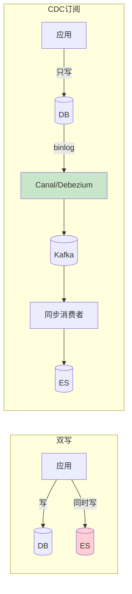

# 精通设计搜索与自动补全

> 搜索是内容型产品的核心入口（电商搜商品、社区搜帖子、网盘搜文件）。这道题考的是：**写入侧如何把数据同步到搜索引擎、查询侧如何做相关性排序、以及自动补全这个独立子问题**。
>
> 本篇按 RESHADED 走。倒排索引、BM25、向量检索的原理在 [elasticsearch 专题](../elasticsearch/INDEX.md) 已讲透，本篇聚焦"如何设计一个搜索系统"，重叠处一句话带过并链接。

---

## 一、需求

### 1.1 功能需求

- 全文检索：输入关键词，返回相关结果；
- 相关性排序：最相关的排前面；
- 自动补全：输入时实时提示候选词（search suggestion）；
- 拼写纠错、同义词。

### 1.2 非功能需求

- **低延迟**：搜索 p99 < 200ms，自动补全要更快（< 50ms，每次按键都触发）。
- **近实时**：新内容尽快可被搜到（秒级~分钟级）。
- **高相关性**：排序质量直接决定体验。

### 1.3 容量估算

参照 [S02](./S02-精通-容量估算与必背数字.md)：搜索 QPS、文档总量、写入（新内容）速率。自动补全 QPS 远高于搜索（每输入一个字符就请求一次），是独立的高频低延迟问题。

---

## 二、倒排索引与 ES 落地

全文检索的核心是**倒排索引**（词 → 包含该词的文档列表），这是搜索引擎的基础数据结构，原理见 [ES 倒排索引与 Lucene](../elasticsearch/01-精通-倒排索引-与-Lucene.md)。

工程上**直接用 Elasticsearch**（或 OpenSearch），不要自己造轮子。设计要点：

- **索引设计**：定义字段、分词器（analyzer，中文用 IK/分词模型）、是否可检索/可排序，见 [ES Mapping 与 Analyzer](../elasticsearch/05-精通-Mapping-与-Analyzer.md)。
- **分片与副本**：按数据量和 QPS 规划分片数（影响并行度）和副本数（影响读吞吐与可用），见 [ES 分片与路由](../elasticsearch/04-精通-分片与路由.md)。
- ES 只放**可检索字段 + 排序字段 + 摘要**，完整数据留在主库（DB），搜到 id 后回主库取详情（或 ES 存足够展示的字段）。

---

## 三、数据同步 DB→ES

搜索系统的关键工程问题：**业务数据在 DB，怎么同步到 ES**？两种方案：

| 方案 | 优点 | 缺点 |
|---|---|---|
| 双写（应用同时写 DB 和 ES） | 简单直接 | 两次写难保一致（一个成功一个失败）、耦合、ES 抖动影响主流程 |
| **CDC 订阅 binlog**（推荐） | 解耦、不漏、对业务无侵入、最终一致 | 多一套链路、有同步延迟 |

**推荐 CDC**：应用只管写 DB，Canal/Debezium 订阅 binlog → Kafka → 消费者写 ES（见 [S05 缓存一致性](./S05-精通-缓存与异步化设计.md) 同款思路）。全量初始化（首次灌数据）+ 增量同步（binlog）配合。同步是最终一致，ES 比 DB 落后秒级可接受。

---

## 四、相关性排序

搜索质量的核心是排序。基础是 **BM25**（ES 默认打分，衡量词频/逆文档频率/文档长度），见 [ES BM25 与 Reranking](../elasticsearch/07-精通-BM25-与-Reranking.md)。但纯文本相关不够，要叠加业务信号：

- **业务加权**：销量、评分、新鲜度、点击率等加权进排序（电商搜索"相关 + 好卖"）。
- **多路召回 + 重排（rerank）**：先用多种方式召回候选（关键词 + 向量语义召回），再用更复杂的模型（甚至机器学习排序 LTR / 大模型 rerank）对候选精排。
- **向量/语义检索**：用 embedding 做语义召回，解决"换个说法搜不到"，见 [ES 向量检索](../elasticsearch/08-精通-向量检索.md) 与 [ai-backend RAG](../ai-backend/A07-精通-RAG-架构.md)。

排序通常分两阶段：**召回（快、广、粗）→ 精排（慢、准、窄）**，这是搜索/推荐的通用范式。

---

## 五、自动补全

自动补全是**独立子问题**——它不是普通搜索，要求每次按键 < 50ms 响应，前缀匹配为主。专门的结构：

| 方案 | 机制 | 特点 |
|---|---|---|
| Trie（前缀树） | 树按字符前缀组织候选词 | 经典，前缀查询快 |
| FST（有限状态转换器） | Lucene 用，压缩的前缀结构 | 省内存，ES 底层用 |
| ES completion suggester | ES 内置补全，基于 FST | 开箱即用，专为补全优化 |
| 前缀 + 热度排序 | 候选按搜索热度/权重排序 | 补全要给"最可能"的词 |

要点：
- **不要用普通 match 查询做补全**（慢、不专为前缀优化）。用专门的补全结构。
- **补全候选按热度排序**：输入"苹"，优先提示"苹果手机"（高频）而非冷门词。
- **拼音补全**（中文）：支持拼音/首字母触发（"pg"→"苹果"），需建拼音索引。

---

## 六、拼写纠错与同义词

- **拼写纠错**：用编辑距离（Levenshtein）找相近词（"iphnoe"→"iphone"），ES 有 fuzzy 查询和 suggester。常基于高频词典纠错。
- **同义词**：维护同义词词典（"番茄"="西红柿"），查询或索引时扩展，提升召回。
- **分词与归一化**：大小写、繁简、全半角统一，分词质量直接影响召回（中文分词尤其关键）。

---

## 七、分页与深翻页

- **普通分页**：`from + size`，但**深翻页是陷阱**——`from=10000` 要求 ES 在每个分片取前 10000+size 再汇总丢弃，代价随页数剧增（与 [S08 Feed](./S08-精通-设计Feed流.md) offset 深分页同理）。
- **search_after**：用上一页最后一条的排序值作游标向后翻，恒定代价，适合深翻页/无限滚动。
- **scroll / PIT**：导出大量结果用，非交互式翻页。
- **业务上限**：搜索一般限制最大页数（如最多 100 页），符合用户行为且避免深分页滥用。

---

## 陷阱清单

- **双写 DB 和 ES 不一致**：一个成功一个失败，数据错乱。优先 CDC 订阅 binlog。
- **ES 当主库**：把唯一数据只放 ES。ES 是检索层，主数据在 DB，ES 可重建。
- **用普通查询做自动补全**：慢且不专优。用 completion suggester/Trie/FST。
- **补全不按热度排**：提示冷门词，体验差。候选按热度/权重排序。
- **from+size 深翻页**：页数大时性能崩。用 search_after。
- **忽视中文分词**：分词差直接导致搜不到/搜不准。选好分词器 + 同义词。
- **只做关键词召回**：换个说法就搜不到。补语义/向量召回。
- **同步无全量初始化**：只接增量 binlog，历史数据进不了 ES。要全量 + 增量。

---

## 2026 现状

- **混合检索（Hybrid Search）成主流**：关键词（BM25）+ 向量语义召回融合，再 rerank，显著提升相关性，ES 8.x 原生支持，见 [ES 向量检索](../elasticsearch/08-精通-向量检索.md)。
- **搜索与 RAG 融合**：搜索系统成为大模型 RAG 的召回层，"搜索即检索增强"，见 [A07 RAG 架构](../ai-backend/A07-精通-RAG-架构.md)。
- **大模型 rerank / 查询理解**：用 LLM 做查询意图理解、结果重排、生成式答案（搜索结果直接给摘要答案）。
- **CDC 标准化**：Debezium/Flink CDC 成为 DB→ES 同步的事实标准，替代脆弱的双写。
- **ES vs 替代**：OpenSearch（AWS fork）、向量数据库（Milvus/pgvector）在语义检索分流，见 [ES vs OpenSearch](../elasticsearch/11-ES-vs-OpenSearch.md)、[pgvector](../postgresql/06-精通-pgvector-与向量检索.md)。

---

## 练习题

1. 业务数据在 MySQL，如何同步到 ES 供搜索？对比"双写"和"CDC 订阅 binlog"两种方案。

参考答案

双写：应用在写 MySQL 的同时也写 ES。优点是直接、实时；缺点是两次写难保证一致性（写完 DB 后写 ES 失败，数据就不一致）、业务代码与 ES 强耦合、ES 抖动会影响主业务写入、难处理重试与顺序。CDC 订阅 binlog（推荐）：应用只写 MySQL，由 Canal/Debezium 订阅 binlog，将变更发到 Kafka，消费者据此更新 ES。优点是与业务解耦（应用无感知）、不漏变更、可重放、ES 故障不影响主库写入、天然支持顺序与重试；缺点是多一套链路、有秒级同步延迟（最终一致，通常可接受）。落地时还需"全量初始化（首次灌历史数据）+ 增量同步（binlog）"配合。多数生产系统选 CDC。

2. 为什么自动补全要用专门的数据结构（Trie/FST/completion suggester），而不能直接用普通搜索查询？

参考答案

因为自动补全的需求和普通搜索不同：①**延迟要求极苛刻**——用户每敲一个字符就触发一次，必须 < 50ms，而普通全文检索（分词、倒排、打分、排序）相对重，达不到这个延迟和 QPS；②**以前缀匹配为主**——补全是"以输入为前缀的候选词"，普通 match 查询不是为前缀优化的；③**候选要按热度排序**给最可能的词。专门结构如 Trie（前缀树，沿前缀路径快速找候选）、FST（压缩前缀结构，省内存，Lucene/ES 底层用）、ES completion suggester（基于 FST 专为补全设计）能在极低延迟内返回按权重排序的前缀候选。用普通查询做补全会慢、占资源且体验差。

3. 搜索相关性排序通常分哪两个阶段？为什么这样设计？

参考答案

分**召回（recall）**和**精排（rerank）**两阶段。召回：用相对轻量、可扩展的方式（BM25 关键词召回 + 向量语义召回等多路）从海量文档中快速捞出一批候选（如几百上千个），追求"快、广、不漏"，召回率优先。精排：对召回的小批候选用更复杂、更准的模型（业务加权、机器学习排序 LTR、甚至大模型 rerank）精细打分排序，追求"准"，取最终 Top N。这样设计的原因：直接对全量文档跑复杂精排模型计算量不可承受；而只用简单打分又不够准。两阶段把"规模"和"精度"解耦——召回处理规模、精排保证质量，是搜索和推荐系统的通用范式。

4. `from + size` 深翻页为什么有性能问题？search_after 如何解决？

参考答案

`from + size` 深翻页（如 from=10000）的问题：ES 是分布式的，要返回全局排序的第 10000-10010 条，每个分片都必须取出自己的前 10010 条交给协调节点汇总排序，再丢弃前 10000 条只留 10 条。随着 from 增大，每个分片要处理和传输的数据线性增长，内存和耗时急剧上升（且有 max_result_window 限制）。search_after 解决：不用偏移量，而用"上一页最后一条文档的排序值"作为游标，下一页查询条件为"排序值在该游标之后的前 size 条"，每个分片只需定位游标位置后取 size 条，代价恒定、与翻到多深无关，非常适合深翻页和无限滚动。代价是只能顺序翻页（不能跳页），需要稳定唯一的排序键。

5. 设计中文搜索时，分词和同义词为什么重要？举例说明处理不好的后果。

参考答案

中文没有天然空格分隔，必须靠分词把句子切成词条建倒排索引和匹配，分词质量直接决定召回。例：文档"番茄炒蛋的做法"，若分词器把"番茄炒蛋"错切或用户搜"西红柿"，处理不好就搜不到——①分词错误（如把"南京市长江大桥"切成"南京/市长/江大桥"）导致索引和查询词条对不上，召回失败或召回错误结果；②不做同义词，"番茄"和"西红柿"、"土豆"和"马铃薯"被当成不相关词，用户用另一种说法就搜不到本应匹配的内容。处理：选用合适的中文分词器（IK/基于模型的分词）、维护同义词词典在索引或查询时扩展、做大小写/繁简/全半角归一化、必要时加拼音支持。分词和同义词是中文搜索召回率的生命线。

6. ES 在搜索系统里应该存什么、不存什么？为什么不能把 ES 当主数据库？

参考答案

ES 应存：可检索字段（标题、正文、标签等需要全文检索的）、排序/过滤字段（价格、销量、时间、分类）、以及用于结果展示的摘要字段（这样搜出来能直接展示列表，不必每条回源）。不应把完整、权威的业务数据只放 ES。不能把 ES 当主库的原因：①ES 是为检索优化的，不保证关系数据库级的事务、一致性和约束；②近实时（写入到可见有刷新延迟），不适合强一致读写；③ES 数据应是"可从主库重建"的派生数据——索引结构变更、故障恢复时需要从主库（DB）全量重灌。正确架构：DB 是唯一真相源，ES 是从 DB 同步出来的检索副本；搜索命中后拿 id（或 ES 里的展示字段），需要完整/最新数据时回 DB 取。这样既享受 ES 的检索能力，又保证数据安全和一致性。

7. 什么是混合检索（Hybrid Search）？它解决了纯关键词检索的什么问题？

参考答案

混合检索是把**关键词检索（如 BM25，基于词面匹配）**和**向量/语义检索（基于 embedding 的语义相似）**两种召回结合，再统一排序/rerank。它解决纯关键词检索的核心短板——**词面不匹配但语义相关搜不到**：纯 BM25 依赖词项重合，用户换个说法（同义、近义、口语化）或问题式查询时，因关键词对不上而召回失败；向量检索把查询和文档映射到语义空间按相似度召回，能找到"意思相近但用词不同"的内容。但向量检索也有弱点（对精确关键词、专有名词、数字匹配不如关键词），所以两者互补：关键词保证精确匹配，向量保证语义召回，融合后召回更全、相关性更高。ES 8.x 原生支持，且是大模型 RAG 召回层的主流方案（见 A07 RAG）。

