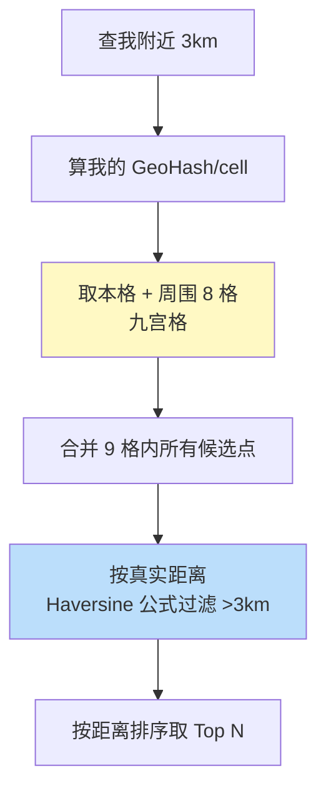

# 精通设计附近的人

> "附近的人/餐厅/车"（LBS，基于位置的服务）是地理位置类应用的核心：微信附近的人、美团找店、滴滴叫车。它的难点很集中：**如何高效地做地理范围查询**——经纬度是二维的，普通数据库索引搞不定。
>
> 本篇按 RESHADED 走，核心是 GeoHash / S2 这类**空间编码**思想，把二维地理问题降成一维可索引问题。

---

## 一、需求

### 1.1 功能需求

- 查询"我附近 N 公里内"的人/店；
- 按距离排序；
- 用户位置实时更新（移动中）。

### 1.2 非功能需求

- **低延迟**：附近查询要快（< 100ms）。
- **高并发**：热门城市/时段查询量大。
- **海量位置点 + 高频更新**：移动用户位置不断变化。

### 1.3 容量估算

参照 [S02](./S02-精通-容量估算与必背数字.md)：在线用户数 × 位置上报频率 = 写 QPS（可能很高，移动中频繁上报）；附近查询 QPS。位置更新的写热点和查询是两个压力点。

---

## 二、为什么不能直接 SQL 范围扫

朴素想法：存 `(lat, lng)`，查 `WHERE lat BETWEEN ? AND ? AND lng BETWEEN ? AND ?`。问题：

- **两个范围条件无法用一个 B-tree 复合索引高效命中**（见 [B08 索引](../backend/B08-精通数据库索引.md)）：复合索引 `(lat, lng)` 对 lat 做范围后，lng 的范围条件无法再走索引，退化成大量扫描。
- 海量点 + 高并发下，这种查询会扫描太多行，延迟不可接受。

**根本矛盾**：地理位置是二维的，而 B-tree 索引是一维有序的。解法是**用空间编码把二维降成一维**——让"地理邻近"变成"编码前缀相同/数值相近"，从而能用一维索引。

---

## 三、GeoHash 原理

**GeoHash** 把经纬度交替二分编码成一个字符串，核心性质：**地理位置越近，GeoHash 前缀越长相同**。

原理简述：
- 把经度范围 [-180,180]、纬度 [-90,90] 反复二分，每次记一个 bit（在左半=0/右半=1），经纬度交替取 bit。
- 把 bit 串按 Base32 编码成字符串（如 `wx4g0e`）。
- 字符串越长，精度越高（格子越小）：

| GeoHash 长度 | 格子大小（约） |
|---|---|
| 5 位 | ~5 km |
| 6 位 | ~1.2 km |
| 7 位 | ~150 m |
| 8 位 | ~38 m |

查询"附近"：算出我的 GeoHash，**找前缀相同的点**（同前缀 = 同一个格子 = 地理邻近）。一维字符串前缀匹配，普通索引（或 Redis）就能高效做。

### 3.1 边界突变问题

GeoHash 的硬伤：**相邻位置可能落在不同格子，前缀差异大**。两个点物理上只隔 10 米，但正好跨在格子边界两侧，GeoHash 前缀完全不同 → 只查同前缀会漏掉边界另一侧的邻居。

**解法：查九宫格**——不仅查自己所在格子，还查周围 8 个相邻格子，合并结果。这样跨边界的邻居也能覆盖到（见第六节）。

---

## 四、Google S2 与四叉树

GeoHash 之外的更优方案：

- **Google S2**：把地球表面映射到一个立方体的六个面，再用希尔伯特曲线（Hilbert curve）编码成 64 位 cell id。相比 GeoHash，**S2 的格子大小更均匀、边界处理更好、邻居计算更精确**（希尔伯特曲线让相邻 cell 的 id 也更接近）。滴滴等 LBS 大量用 S2。
- **四叉树（QuadTree）**：把空间递归四分，点多的区域分得更细（自适应密度）。适合点分布不均的场景，但实现和动态更新比编码方案复杂。

| 方案 | 优点 | 缺点 |
|---|---|---|
| GeoHash | 简单、字符串前缀、Redis 原生支持 | 边界突变、格子随纬度变形 |
| S2 | 格子均匀、邻居精确、64 位整数 | 实现复杂 |
| 四叉树 | 自适应密度 | 动态更新复杂 |

---

## 五、Redis GEO 落地

Redis 内置 **GEO** 命令，底层就是用 GeoHash 编码成 ZSet 的 score 实现的（见 [redis 专题](../redis/INDEX.md)），开箱即用：

```
GEOADD drivers 116.40 39.90 "driver1"     # 添加位置
GEOSEARCH drivers FROMMEMBER "user1" BYRADIUS 3 km ASC   # 查 3km 内并按距离升序
GEOPOS drivers "driver1"                   # 取坐标
```

- `GEOADD` 把经纬度编码进 ZSet score；`GEOSEARCH`（Redis 6.2+）做半径/矩形范围查询并可按距离排序。
- 适合实时性高、数据可放内存的 LBS（如在线司机位置）。海量则分片（按城市/区域）。
- 持久数据/复杂查询可用 PostGIS（[postgresql 扩展](../postgresql/18-精通-扩展生态.md)）或 ES geo 查询。

---

## 六、范围查询实现



- **九宫格补边界**：取自己格子 + 周围 8 格，解决 GeoHash 边界突变漏邻居问题。
- **二次精确过滤**：格子是矩形近似，候选点要用真实球面距离（Haversine 公式）算精确距离，过滤掉超出半径的、再排序。
- **圆形 vs 矩形**：业务是"半径内"（圆），用格子（矩形）粗筛后按圆形半径精筛。

---

## 七、热点城市分片与移动中位置更新

- **写热点**：一线城市（北上广深）位置点密集、更新频繁，单分片热点。按城市/区域分片（见 [S04](./S04-精通-数据层扩展设计.md)），热点城市单独承载。
- **高频位置更新**：移动用户（如行驶中的车）每几秒上报位置，写 QPS 极高。对策：
  - **降频/聚合**：客户端按距离或时间阈值上报（移动超 50m 或每 5s），减少无效更新。
  - **写聚合**：用内存（Redis GEO）承接高频更新，而非每次写 DB（同 [S10 计数](./S10-精通-设计排行榜与计数系统.md) 写聚合思想）。
- **数据时效**：位置数据时效短，可设 TTL，过期的不再展示。

---

## 陷阱清单

- **直接 SQL 双范围查**：`lat BETWEEN AND lng BETWEEN` 走不好索引、扫描爆炸。用空间编码。
- **GeoHash 只查同前缀**：边界突变漏掉相邻格子的邻居。必须查九宫格。
- **格子粗筛后不精确过滤**：格子是矩形近似，不按真实距离过滤会返回超范围的点。用 Haversine 二次过滤。
- **位置高频写 DB**：每次上报都写库，DB 被打爆。用 Redis GEO 承接 + 客户端降频。
- **不分片扛全国**：全国位置点压一个实例。按城市/区域分片。
- **忽略纬度变形**：GeoHash 格子在高纬度变形，精度估算要注意。
- **位置不设时效**：过期位置仍被查到（人早走了）。设 TTL。

---

## 2026 现状

- **S2 / H3 流行**：Uber 开源的 H3（六边形网格）在 LBS、空间分析中广泛使用，六边形邻居距离更一致，优于方格。
- **Redis GEO + Valkey** 仍是实时 LBS（在线位置）的便捷选择，见 [redis 专题](../redis/INDEX.md)。
- **PostGIS 成熟**：PostgreSQL + PostGIS 处理复杂地理查询（多边形、路网、空间 join）是持久化 LBS 的强力方案，见 [P18 扩展生态](../postgresql/18-精通-扩展生态.md)。
- **边缘 + 实时计算**：高频位置流用 Flink 实时处理（电子围栏、轨迹分析）。
- **隐私合规**：位置是敏感数据，"附近的人"类功能受隐私法规约束（模糊化、授权、可关闭）。

---

## 练习题

1. 为什么"查附近的人"不能直接用 `WHERE lat BETWEEN ? AND ? AND lng BETWEEN ? AND ?` + B-tree 索引？

<details><summary>参考答案</summary>

因为这是两个范围条件，而 B-tree 复合索引只能高效支持"最左前缀的等值 + 最后一个范围"模式。对复合索引 `(lat, lng)`：lat 用了范围条件后，索引扫描出 lat 在区间内的所有行，但这些行的 lng 在索引里不是有序聚集的，lng 的范围条件无法继续用索引过滤，只能逐行回表/扫描判断。结果是扫描大量候选行，海量点 + 高并发下延迟不可接受。根本原因是地理位置是二维的，而 B-tree 是一维有序结构，二维范围查询无法被一维索引高效覆盖。解法是用空间编码（GeoHash/S2）把二维降为一维（邻近→前缀相同/数值相近），从而能用一维索引或 Redis ZSet 高效查询。

</details>

2. 解释 GeoHash 的核心性质，以及它如何把二维地理查询变成可索引的一维问题。

<details><summary>参考答案</summary>

GeoHash 把经纬度通过交替二分编码成一个字符串（Base32），核心性质是：**地理位置越接近，GeoHash 字符串的公共前缀越长**（因为前缀对应更大的包含区域，同前缀=同一个格子=空间邻近），字符串越长格子越小、精度越高。这样就把"二维范围查询"转化成"一维字符串前缀匹配"：要找附近的点，先算出查询点的 GeoHash，再找前缀相同的点即可。而字符串前缀匹配可以用普通 B-tree 索引（前缀范围）或 Redis 高效完成。本质是用空间填充曲线把二维空间的邻近关系映射到一维编码的邻近/前缀关系，从而复用一维索引能力。

</details>

3. GeoHash 的"边界突变"问题是什么？如何解决？

<details><summary>参考答案</summary>

边界突变：GeoHash 把空间切成离散格子，两个物理上非常接近的点，若恰好分处格子边界的两侧，它们会落入不同格子，GeoHash 前缀差异很大（甚至完全不同）。如果查询只取"与我同前缀（同格子）"的点，就会漏掉那些其实很近但在相邻格子里的邻居——尤其当查询点靠近格子边缘时遗漏严重。解决方法是**查九宫格**：不仅查询点所在的格子，还查询其周围 8 个相邻格子，合并这 9 个格子内的所有候选点，这样跨任意边界的邻居都能被覆盖；再对合并的候选用真实球面距离（Haversine）做二次精确过滤和排序。S2/H3 等方案因编码方式不同，邻居计算更精确，也能缓解此问题。

</details>

4. Redis GEO 底层是怎么实现的？它适合什么场景，不适合什么？

<details><summary>参考答案</summary>

Redis GEO 底层复用 **ZSet（有序集合）**：`GEOADD` 把经纬度用 GeoHash 编码成一个 52 位整数作为 member 的 score 存进 ZSet，于是"地理邻近"就对应"score 相近"，范围查询（`GEOSEARCH`）即在 ZSet 上做 score 区间扫描 + 距离过滤，`GEOPOS` 则把 score 解码回经纬度。适合：实时性高、数据量可放内存的 LBS，如在线司机/骑手位置、"附近的人"，开箱即用（内置半径/矩形查询和按距离排序），更新和查询都很快。不适合：①数据量超过单机内存的超大规模（需按城市/区域分片）；②复杂地理查询——多边形包含、空间 join、路网距离、电子围栏等，ZSet/GeoHash 做不了，应用 PostGIS；③需要强持久化和复杂事务的权威地理数据（Redis 是加速层，权威数据宜在 PostGIS/DB）。即 Redis GEO 是"实时、简单、可放内存"场景的便捷之选。

</details>

5. 移动中的用户每几秒上报一次位置，写 QPS 极高。如何设计才能不打爆存储？

<details><summary>参考答案</summary>

①**客户端降频上报**：不固定高频上报，而按阈值触发——移动超过一定距离（如 50m）或超过一定时间（如 5s）才上报，静止时几乎不报，大幅削减无效写入；②**用内存承接而非每次写 DB**：位置更新写 Redis GEO（内存、十万级 QPS），不每次 UPDATE 数据库；③**写聚合**：高频更新在内存覆盖最新值即可（位置只关心最新，旧值无需保留），必要时定时把活跃位置快照落库，思路同 S10 计数的写聚合；④**位置数据设 TTL**：位置时效短，过期自动淘汰，避免无限增长且防止展示"早走了的人"；⑤热点区域分片（见下题）。核心是"客户端少报 + 内存承接 + 只留最新 + 设时效"，把高频写挡在内存层、削掉冗余。

</details>

6. 一线城市位置点密集、更新频繁形成写热点，如何缓解？

<details><summary>参考答案</summary>

按**地理维度分片**：以城市或区域作为分片键（如每个城市一个 Redis GEO key / 一组实例），把全国流量打散到多个分片，避免单实例承载全部；北上广深这类超热城市可单独分配更多资源或进一步按区/网格细分（如把一个城市再按区域格子拆成多个 key），把热点继续打散。配合：①查询天然带城市/区域上下文，路由到对应分片即可，不影响"附近"语义（附近查询本就局限在小范围，跨分片很少）；②热点城市独立扩容、与冷门地区隔离，防止互相影响；③结合前题的客户端降频和内存承接，进一步降低单分片写压力。本质是 S04 的分片思想在地理维度的应用——选地理位置作分片键，既分散热点又保证"附近"查询落在单/少数分片。

</details>

7. GeoHash、Google S2、四叉树三种空间索引方案各有什么优缺点？分别适合什么场景？

<details><summary>参考答案</summary>

**GeoHash**：把经纬度交替二分编码成字符串，前缀相同=邻近。优点：简单、是字符串前缀可直接用普通索引/Redis（GEO 底层就是它）、生态成熟；缺点：有边界突变（需查九宫格补救）、格子随纬度变形（高纬度不均匀）。适合：实现简单、用 Redis 即可的常规 LBS。**Google S2**：把地球映射到立方体六面再用希尔伯特曲线编码成 64 位 cell id。优点：格子大小更均匀、邻居计算更精确、希尔伯特曲线让相邻 cell 的 id 也接近、整数运算高效；缺点：实现/理解复杂。适合：对精度和均匀性要求高的大规模 LBS（如网约车，滴滴用 S2）。**四叉树**：把空间递归四分，点密集处分更细（自适应密度）。优点：适应数据分布不均、查询可剪枝；缺点：动态更新/再平衡复杂、实现重。适合：点分布极不均、偏静态的空间数据。补充：Uber 的 **H3**（六边形网格）邻居距离更一致，也很流行。选择：要快糙猛用 GeoHash/Redis GEO；要精准均匀用 S2/H3；分布极不均且静态可考虑四叉树。

</details>
