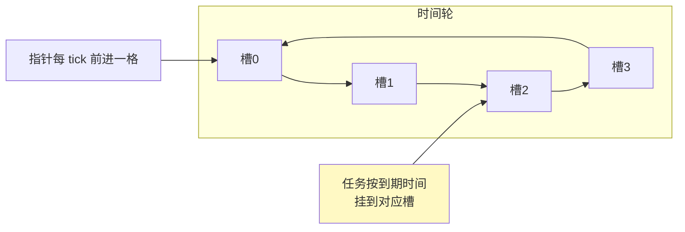
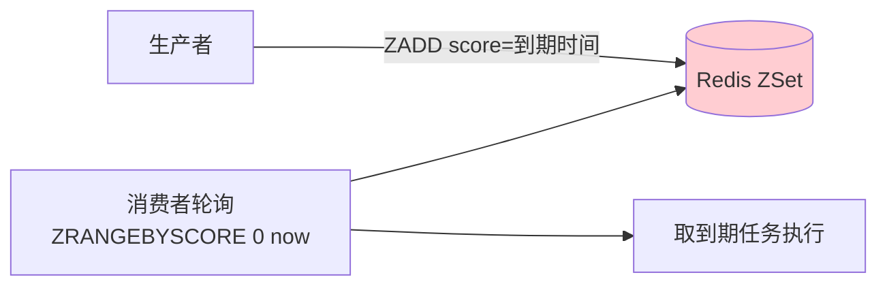
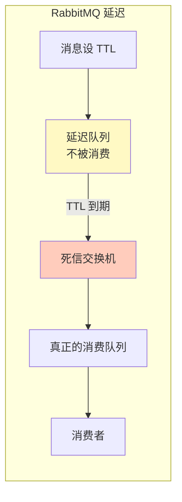
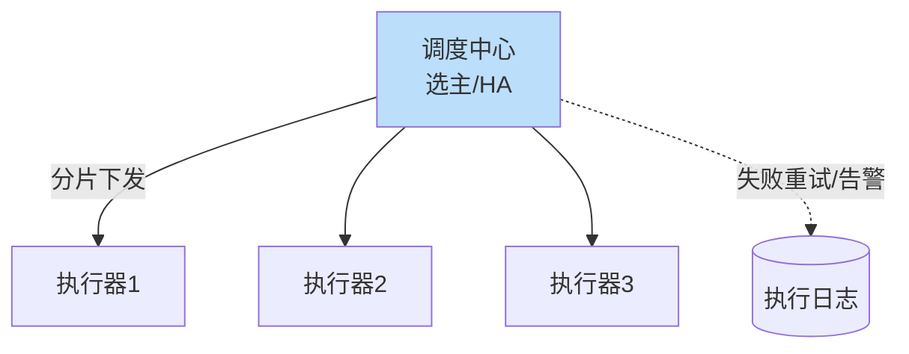

# 精通设计延迟队列与定时任务

> "30 分钟未支付自动关单"、"下单 7 天后自动确认收货"、"失败任务 5 分钟后重试"——这些都是**延迟任务**。而"每天凌晨跑对账"、"每分钟聚合榜单"是**定时任务**。它们看似简单，在海量、分布式、不丢不重的约束下却很有讲究。
>
> 本篇讲清两类任务的本质区别，以及时间轮、Redis ZSet、MQ 延迟、分布式调度等核心方案的取舍。

---

## 一、需求场景

先区分两个容易混淆的概念：

| 概念 | 触发方式 | 例子 |
|---|---|---|
| **延迟队列** | 每条消息**各自**延迟一段时间后执行（相对时间） | 订单 30min 未付关单、延迟重试 |
| **定时任务** | 按**固定时刻/周期**触发（cron） | 每天 2:00 对账、每分钟聚合榜单 |

两者实现不同：延迟队列是"海量各异的一次性定时器"；定时任务是"少量周期性调度"。很多系统两者都要。

### 容量考量

延迟队列要支撑海量并存的延迟项（如千万笔待支付订单各有关单时间），核心是高效地"到点取出"；定时任务的核心是"分布式下不重不漏地触发"。

---

## 二、时间轮算法

**时间轮（Timing Wheel）** 是高效管理大量定时器的经典结构，Netty 的 `HashedWheelTimer`、Kafka 的延迟操作都用它。



- 像钟表：一圈 N 个槽，指针每 tick（如 1s）走一格，走到某槽就执行该槽里到期的任务。
- 添加定时器 O(1)（算出落在哪个槽，挂上去），到期触发也高效。
- **分层时间轮**：一圈表示有限时间（如 60 槽 × 1s = 60s）。更长的延迟用多层（秒轮、分轮、时轮，类似钟表的时分秒），到期时从高层"降级"到低层，支持很长延迟而不浪费空间。

时间轮适合**单机内存里管理海量短期定时器**，但重启会丢（需持久化）。

---

## 三、Redis ZSet 延迟队列

分布式延迟队列最常用的方案：用 **ZSet，score = 到期时间戳**。

```
ZADD delay_queue <到期时间戳> <任务ID>     # 投递延迟任务
# 消费者轮询：取已到期的（score <= now）
ZRANGEBYSCORE delay_queue 0 <now> LIMIT 0 N
```



要点：
- **到期判断**：消费者定期（如每秒）查 `score <= now` 的任务取出执行。
- **多消费者防重复**：多个消费者同时轮询，同一任务可能被取多次。用 **Lua 原子地"取出 + 删除"**（或 `ZPOPMIN` + 判断），保证一个任务只被一个消费者拿到（同 [S07 秒杀](./S07-精通-设计秒杀系统.md) 的原子操作思想）。
- **精度**：取决于轮询间隔（秒级），够用。
- **持久化**：Redis 持久化 + 任务源可重放，防丢。

ZSet 方案简单、分布式友好，是中小规模延迟队列首选。

---

## 四、消息队列延迟方案

用现成 MQ 实现延迟，各家能力不同：

| MQ | 延迟支持 | 说明 |
|---|---|---|
| **RocketMQ** | 原生延迟级别 + 5.x 任意延迟 | 最方便，国内常用；4.x 固定 18 个延迟级别，5.x 支持任意时刻 |
| **RabbitMQ** | TTL + 死信队列（DLX） | 消息设 TTL，过期进死信队列被消费，间接实现延迟 |
| **Kafka** | 无原生延迟 | 需外部方案：暂停消费 + 时间轮，或写到"延迟主题"由外部调度 |



**为什么 Kafka 没有原生延迟**：Kafka 是顺序日志、按 offset 顺序消费，天然不支持"跳过未到期、只消费到期"的乱序语义。要延迟得绕（如按延迟时长建多个固定延迟 topic + 时间轮调度）。这是 Kafka 设计取向的体现，见 [kafka 专题](../kafka/INDEX.md)。

---

## 五、海量定时器设计

千万级并存的延迟任务（如电商所有待支付订单），设计要点：

- **不要每个任务一个 Timer/线程**：内存和调度开销爆炸。用时间轮或 ZSet 统一管理。
- **分层存储**：远期任务存 DB（如关单时间 > 1 天的），临近的才加载进内存时间轮/Redis（"DB + 内存时间轮"两级，定时把临近到期的从 DB 捞进内存）。
- **扫描效率**：避免全表扫"哪些到期了"。ZSet 按 score 有序天然高效；DB 方案要在到期时间上建索引并分批扫。

---

## 六、分布式定时任务调度

单机 cron 的问题：机器挂了任务不执行；多机部署同一 cron 会**重复执行**。需要分布式调度（如 XXL-JOB、Elastic-Job、Quartz 集群）。



核心机制：

- **避免重复执行**：调度中心统一触发（不是每台机器各自 cron），或用分布式锁/选主保证同一任务同一时刻只一个实例跑（见 [M13 分布式锁](../microservices/13-精通-分布式锁与协调.md)）。
- **任务分片（sharding）**：大任务（如处理千万订单）拆成多片，分给多个执行器并行跑，每片处理一部分（按 id 取模），提升吞吐。
- **失败重试与告警**：任务失败自动重试，超限告警。
- **HA**：调度中心自身要高可用（选主），不能成单点。

---

## 七、幂等与漏执行/重复执行

分布式定时/延迟任务必须考虑"不丢不重"：

- **重复执行**：任务可能被触发多次（重试、多实例、消息重投）。任务逻辑必须**幂等**（如关单用状态机 CAS：`UPDATE ... WHERE status=待支付`，已处理则影响 0 行，见 [S05](./S05-精通-缓存与异步化设计.md)、[M09 幂等](../microservices/09-精通-幂等与去重.md)）。
- **漏执行**：调度中心宕机、消息丢失导致任务没跑。对策：持久化任务 + 重启恢复 + 兜底扫描（定时全量扫"该执行但没执行"的，补偿触发）。
- **时钟问题**：分布式机器时钟不一致影响到期判断，依赖 NTP 同步；关键场景以中心时间为准。

**兜底扫描是终极保险**：即使延迟队列/调度漏了，定时全量对账扫描能兜住（如每小时扫一遍超时未关的订单），这与前面各篇的"对账兜底"一脉相承。

---

## 陷阱清单

- **延迟队列 vs 定时调度混为一谈**：用错方案。各异的相对延迟用延迟队列，固定周期用定时调度。
- **每个延迟任务一个线程/Timer**：海量下内存和调度爆炸。用时间轮/ZSet 统一管理。
- **ZSet 延迟队列多消费者重复取**：不原子取出导致一个任务被多个消费者执行。用 Lua 原子取删。
- **以为 Kafka 能原生延迟**：Kafka 顺序消费不支持。要外部方案或换 RocketMQ。
- **多机 cron 重复执行**：每台机器各自 cron 同一任务跑多遍。用分布式调度/选主。
- **任务不幂等**：重复触发导致重复关单/重复发券。必须幂等。
- **没有兜底扫描**：延迟/调度一旦漏执行就永久丢。加定时全量对账补偿。
- **全表扫到期任务**：性能差。ZSet 有序或 DB 到期时间建索引分批扫。

---

## 2026 现状

- **RocketMQ 5.x 任意延迟**：从固定 18 级延迟升级到任意时刻延迟消息，延迟队列实现更简单，国内广泛采用。
- **Redis 8.0 / Valkey** 的 ZSet 仍是轻量分布式延迟队列的常用方案；Redis Streams 也可做带确认的延迟/任务队列，见 [redis 专题](../redis/INDEX.md)。
- **云原生定时**：K8s CronJob 做容器化定时任务；Serverless 定时触发器（函数计算 Timer Trigger）按需执行，无需常驻，见 [cloud-native](../cloud-native/INDEX.md)。
- **XXL-JOB 等成熟**：分布式任务调度中间件标准化，分片、重试、告警、可视化开箱即用。
- **时间轮在基础设施广泛使用**：Kafka、Netty、各类网关的超时管理底层都是时间轮。

---

## 练习题

1. 延迟队列和定时任务有什么本质区别？各举一个例子，并说明实现思路的不同。

<details><summary>参考答案</summary>

本质区别在触发方式：**延迟队列**是每条任务各自延迟一段相对时间后执行一次（一次性、相对时间、海量且各异），如"订单创建后 30 分钟未支付则关单"——每笔订单有自己的到期时刻。**定时任务**是按固定时刻或周期反复触发（周期性、绝对时间、数量少），如"每天凌晨 2 点跑对账"。实现不同：延迟队列本质是"管理海量各异的一次性定时器并高效到点取出"，用时间轮、Redis ZSet（score=到期时间戳）或支持延迟的 MQ；定时任务本质是"分布式下按 cron 不重不漏地触发少量作业"，用分布式调度中心（XXL-JOB）、K8s CronJob，重点解决多机重复执行和高可用。

</details>

2. 用 Redis ZSet 实现延迟队列，如何防止多个消费者重复消费同一个到期任务？

<details><summary>参考答案</summary>

用 score=到期时间戳存任务，消费者轮询 `ZRANGEBYSCORE 0 now` 取到期任务。若多个消费者同时轮询，同一任务可能被多个消费者同时读到并执行，造成重复。防重复的关键是**原子地"取出 + 移除"**：用 Lua 脚本在一次原子执行里完成"查到期任务 + 从 ZSet 删除它"（或用 `ZPOPMIN` 配合判断 score 是否到期），Redis 单线程保证只有一个消费者能成功取走并删除该任务，其他消费者取不到（已被删），从而保证每个任务只被一个消费者处理一次。此外任务执行本身也应幂等，作为双保险。

</details>

3. 为什么 Kafka 没有原生延迟消息？如果非要用 Kafka 实现延迟，怎么做？

<details><summary>参考答案</summary>

因为 Kafka 是基于分区的顺序日志，消费者按 offset 顺序消费，其模型是"严格顺序、连续推进"，不支持"跳过未到期消息、只挑到期的乱序消费"这种语义——如果队头消息未到期就阻塞，会卡住整个分区后面所有消息。所以 Kafka 不提供原生任意延迟。实现办法：①**固定延迟 topic + 转发**：按延迟时长建若干固定延迟级别的 topic（如 5s/30s/5min...），消息先进对应延迟 topic，由一个调度组件（配合时间轮）在到期后把消息转投到真正的业务 topic 消费；②**暂停消费 + 时间轮**：消费到未到期消息时 pause 该分区、记到时间轮，到期再 resume/转发；③直接改用支持延迟的 MQ（RocketMQ 5.x 任意延迟）或 Redis ZSet。生产中若延迟需求强，多数会选 RocketMQ 或 ZSet 而非硬改 Kafka。

</details>

4. 单机 cron 在分布式部署下有什么问题？分布式任务调度如何解决？

<details><summary>参考答案</summary>

单机 cron 的问题：①**单点**——这台机器宕机，定时任务就不执行了；②**重复执行**——若服务多实例部署，每台机器都配了相同 cron，同一任务会被每个实例各跑一遍（如对账跑 N 遍、发券发 N 次），造成数据错误。分布式调度（XXL-JOB/Elastic-Job/Quartz 集群）的解决：①由**统一的调度中心**触发任务（而非每台机器各自 cron），调度中心高可用（选主/集群），单点不再是问题；②同一任务同一时刻只调度一个执行器实例运行，或用分布式锁/选主保证互斥，避免重复执行；③**任务分片**——把大任务拆片分给多个执行器并行，提升吞吐；④内置失败重试、超时告警、执行日志可视化。这样既避免重复又获得 HA 和扩展性。

</details>

5. 海量待支付订单（千万级）各有关单时间，如何高效管理这些延迟任务？

<details><summary>参考答案</summary>

不能每个订单一个 Timer/线程（内存和调度开销爆炸）。采用**分层 + 高效到期结构**：①**DB + 内存两级**——所有订单的关单时间存 DB（在关单时间字段建索引），不全量加载；用定时任务把"临近到期（如未来几分钟内）"的订单分批捞进内存时间轮或 Redis ZSet 精确触发；②到期触发用 ZSet（score=关单时间，按 score 有序，取 `<=now` 高效）或分层时间轮，O(1)/O(log n) 管理，避免全表扫描判断谁到期；③触发关单逻辑做幂等（状态机 CAS，已支付/已关则跳过）；④**兜底全量扫描**——定时（如每小时）扫一遍 DB 中"已超时但仍待支付"的订单补偿关单，防止内存/队列漏执行。核心是"远期放 DB、近期进内存、有序结构高效取、兜底扫描保底"。

</details>

6. 分布式定时/延迟任务为什么必须幂等？如何保证关单操作幂等？

<details><summary>参考答案</summary>

必须幂等是因为分布式下任务很难保证"恰好执行一次"：重试机制、多实例、消息重投、调度中心故障恢复、兜底扫描与正常触发并发，都可能导致同一任务被触发多次。若不幂等，会重复关单、重复退款、重复发券，造成资损或数据错误。保证关单幂等的做法：用**状态机 + 条件更新（CAS）**——`UPDATE orders SET status='已关闭' WHERE order_id=? AND status='待支付'`，只有当订单仍是"待支付"时更新才生效（影响 1 行），若订单已支付或已关闭则影响 0 行、不产生副作用；据影响行数判断是否真正执行了关单（及后续库存回补等）。这样无论触发多少次，关单只会实际发生一次，其余都是无副作用的空操作。

</details>

7. 即使有了延迟队列和调度中心，为什么还需要"兜底扫描"？

<details><summary>参考答案</summary>

因为延迟队列和调度中心都不是 100% 可靠的：Redis/MQ 可能丢消息，调度中心可能在某段时间宕机导致任务漏触发，时钟漂移或 bug 可能导致到期判断错误，任务执行失败且重试耗尽后被丢弃。这些都会造成"本该执行的任务没执行"（如订单该关单却没关，库存一直锁着）。**兜底扫描**是一道独立的安全网：定时（如每小时/每天）全量或增量扫描"按业务规则本应处于某状态但实际没有"的数据（如"创建超过 30 分钟仍待支付"的订单），补偿执行（关单、回补库存）。它不依赖前面的延迟/调度链路，即使它们全挂了也能最终把状态纠正过来，保证最终一致。这与支付对账、缓存对账是同一思想——关键业务永远要有一个不依赖实时链路的对账/兜底机制。

</details>
