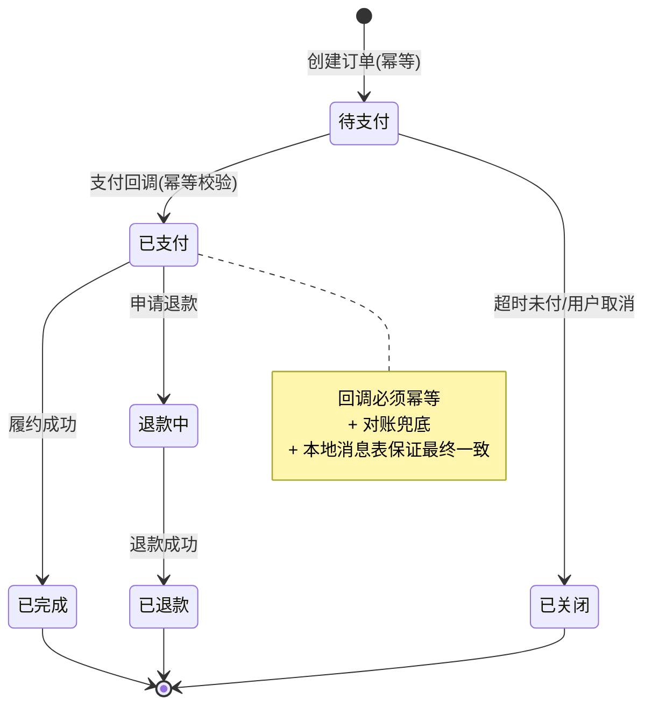
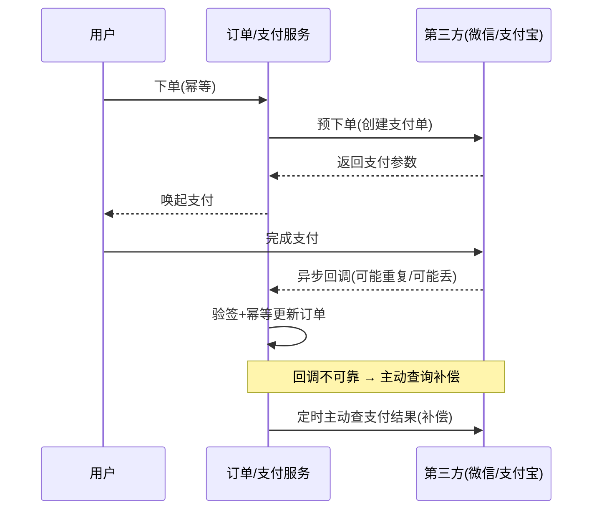

# 精通设计支付与订单系统

> 支付与订单是和钱直接相关的系统，第一原则只有一个：**不能错**——不能少扣、不能多扣、不能丢单、不能重复支付。它把幂等、状态机、分布式事务、对账这些硬核能力全考一遍，是系统设计里"容错要求最高"的一类题。
>
> 本篇按 RESHADED 走，核心是用**状态机 + 幂等 + 对账**三件套构建一个"不丢钱"的系统。最后结合 OfferPilot 自身的订阅 + 人工核验支付场景落地。

---

## 一、需求与核心难点

### 1.1 职责划分

先区分两个系统：

- **订单系统**：管理交易生命周期（下单、待支付、已支付、发货/履约、完成、退款、关闭），是业务状态的载体。
- **支付系统**：对接资金渠道（微信/支付宝/银行/收款码），管理一次资金流转（发起、回调、查询、退款），是钱的载体。

订单驱动支付，支付结果回写订单。两者通过**幂等 + 对账**保持一致。

### 1.2 核心难点

| 难点 | 说明 |
|---|---|
| **不丢钱** | 用户付了钱，订单必须变成已支付——任何环节都不能丢 |
| **强幂等** | 重复下单、重复支付、重复回调都不能造成多扣/多发 |
| **最终一致** | 订单状态、支付状态、库存/权益最终必须一致 |
| **可对账** | 与第三方、内部账务能对上，差错可发现可修复 |

---

## 二、订单状态机

订单的核心是一个**状态机**——所有变更都是受控的状态跃迁，**非法跃迁必须被拒绝**（如"已关闭"不能变"已支付"）。



实现要点：
- **状态跃迁用条件更新（CAS）**：`UPDATE orders SET status='已支付' WHERE order_id=? AND status='待支付'`。影响行数=1 才执行后续，=0 说明状态不对（已处理或非法），直接跳过。这既保证幂等又防非法跃迁。
- **状态机集中校验**：定义合法跃迁表，所有变更走统一入口校验，杜绝代码各处乱改状态。

---

## 三、幂等设计

**幂等是支付系统的命根子。** 三个环节都要幂等：

| 环节 | 重复来源 | 幂等手段 |
|---|---|---|
| 下单 | 用户狂点、网络重试 | 下单幂等 token / 业务唯一键 |
| 支付 | 重复发起支付 | 同一订单同一支付单，唯一约束 |
| 回调 | 第三方重复通知 | 回调按支付单 CAS 更新，重复直接忽略 |

### 3.1 下单幂等

用户重复点"提交订单"或客户端重试，不能创建多个订单。做法：

- **幂等 token**：进入下单页时发一个唯一 token，下单带上，服务端校验 token 只用一次（Redis SETNX）。
- **业务唯一键**：用"用户+商品+活动"等业务维度建唯一索引，重复插入失败即返回已有订单。

### 3.2 回调幂等（最关键）

第三方支付**回调会重复通知**（它没收到你的成功响应就重发）。回调处理必须幂等：

```go
func HandlePayCallback(cb PayCallback) error {
    if !verifySign(cb) {           // 1. 验签：确认是真实回调
        return ErrInvalidSign
    }
    // 2. CAS 更新订单状态：只有"待支付"才更新，重复回调影响 0 行直接返回成功
    n, err := db.Exec(`UPDATE orders SET status='已支付', pay_no=?
                       WHERE order_id=? AND status='待支付'`, cb.PayNo, cb.OrderID)
    if err != nil { return err }
    if rows, _ := n.RowsAffected(); rows == 0 {
        return nil                 // 已处理过，幂等返回成功（让第三方别再重发）
    }
    // 3. 同事务/本地消息表触发后续（发货、加权益）
    return publishOrderPaid(cb.OrderID)
}
```

**关键**：回调要验签（防伪造）、CAS 幂等（防重复）、且**重复回调也要返回成功**，否则第三方会无限重发。

---

## 四、支付流程与第三方对接



铁律：**不能只依赖回调**。回调可能延迟、丢失、乱序。必须有**主动查询补偿**：对"待支付"超过一定时间的订单，主动调第三方查询接口确认真实支付状态，回填订单。回调（快路径）+ 主动查询（兜底）+ 对账（终极保险）三层保证不丢支付。

---

## 五、库存/权益扣减与超时关单

- **下单预占**：下单时预占库存/名额（防超卖，见 [S07 秒杀](./S07-精通-设计秒杀系统.md)），未支付不真正消耗。
- **支付确认**：支付成功后正式扣减、发放权益。
- **超时关单 + 回补**：下单后给有限支付时间（如 30 分钟），超时未付则关单并回补预占的库存/名额。用**延迟队列**触发（见 [S14 延迟队列](./S14-精通-设计延迟队列与定时任务.md)），回补要幂等（防重复回补）。

这条链路（预占 → 确认/超时回补）和秒杀的库存最终一致是同一套思想。

---

## 六、分布式事务保证最终一致

"扣款成功"和"发放权益/发货"往往跨服务，不能用本地事务一把锁住。用最终一致方案：

| 方案 | 机制 | 适用 |
|---|---|---|
| **本地消息表 / 事务消息** | 业务和"待发消息"同库事务写入，再可靠投递触发下游 | 最常用，解决"扣款成功但权益没发" |
| **TCC** | Try 预留 / Confirm 确认 / Cancel 回滚，两阶段 | 强一致要求高、要补偿的场景 |
| **Saga** | 一串本地事务 + 反向补偿 | 长流程多步骤 |

支付场景最常用**本地消息表**：支付成功更新订单 + 写一条"订单已支付"消息（同一本地事务），再由可靠投递把消息发给履约/权益服务消费（幂等）。即使下游暂时挂了，消息不丢、会重试，最终一致。详见 [M08 分布式事务](../microservices/08-精通-分布式事务.md)。

---

## 七、对账与差错处理

**对账是支付系统的终极安全网**——前面所有机制都可能有漏网之鱼，对账兜住。

- **与第三方对账**：每天下载第三方账单，逐笔比对"我方记录"与"第三方记录"，找出：我方有第三方无（可能伪造/错误）、第三方有我方无（漏记的真实支付，要补单)、金额不符等。
- **内部对账**：订单状态、支付流水、资金账务三者交叉核对，发现不一致。
- **差错池 + 人工**：对不平的差错记入差错池，自动补偿能修的自动修，修不了的人工介入。
- **长款/短款处理**：多收的钱（长款）、少收的（短款）按财务流程处理。

没有对账的支付系统是不可信的——再多实时机制，也要有一道离线全量核对兜底。

---

## 八、防重复支付与并发控制

- **重复支付**：用户在两个渠道都付了同一订单。对策：同一订单只允许一个有效支付单；发现重复支付，自动退其一。
- **并发回调/支付**：同一订单的回调与主动查询并发更新，靠状态机 CAS（`WHERE status='待支付'`）保证只成功一次。
- **悬挂**：先收到回调后收到"订单不存在"等异常顺序，要能处理（如回调先到时先记录、订单补建后对账）。

并发安全的根基仍是第二、三节的**状态机 CAS + 幂等**。

---

## 九、结合 OfferPilot 落地

OfferPilot 是订阅制 SaaS（¥39/月起），支付链路除了标准的微信/支付宝，还存在**个人收款码 + 人工核验**的半自动场景（用户扫个人码付款，后台人工/半自动核验到账后开通权益）。前述设计如何套用：

- **状态机**：订单状态扩展出"待核验"——`待支付 → 待核验（用户提交已付凭证）→ 已支付（核验通过开通订阅）/ 已关闭（核验不通过）`。核验是一次人工/半自动的状态跃迁，同样走 CAS 防重复开通。
- **幂等**：人工"确认到账"操作必须幂等——`UPDATE ... SET status='已支付' WHERE order_id=? AND status='待核验'`，防止管理员重复点击导致重复开通/重复发放订阅时长。
- **对账**：个人收款码到账明细与订单逐笔对账，发现"已核验开通但实际没到账"或"到账了没开通"的差错，是这种半自动模式最需要兜底的地方。
- **超时**：待核验超时（如 24h 未提交凭证）自动关单，用延迟队列触发。

> 注意：这里只讲通用设计思路，具体表结构与代码以 OfferPilot 实际实现为准。核心是"人工核验"本质也是状态机的一次受控跃迁，幂等和对账的要求和自动支付一样不能少。

---

## 陷阱清单

- **回调不幂等**：第三方重复回调导致重复发货/重复开权益。回调必须 CAS 幂等。
- **只信回调不主动查**：回调丢失则订单永远卡在待支付、用户付了钱拿不到货。必须主动查询补偿。
- **回调不验签**：伪造回调骗开权益。必须验签。
- **状态随意改**：各处直接 `SET status`，非法跃迁、并发覆盖。用状态机 CAS 统一管控。
- **没有对账**：实时机制漏的差错无人发现，资损不可查。必须离线对账兜底。
- **跨服务用强一致事务**：扣款和发货跨服务硬上 2PC，性能差、耦合重。用本地消息表最终一致。
- **超时不关单不回补**：库存/名额被未支付订单永久锁死。延迟队列关单 + 幂等回补。
- **重复支付不处理**：用户多付不退。检测并自动退款。
- **金额/状态用浮点**：金额用浮点有精度问题。用整数（分）或定点 decimal。

---

## 2026 现状

- **RocketMQ 5.x 事务消息**：让"本地事务 + 消息"的最终一致实现更简单，成为支付最终一致的主流选择，见 [S14](./S14-精通-设计延迟队列与定时任务.md)、[kafka 专题](../kafka/INDEX.md)。
- **强一致存储简化对账**：用 TiDB 等 NewSQL 让订单/账务跨分片强一致，降低对账复杂度，见 [S04 数据层](./S04-精通-数据层扩展设计.md)。
- **支付渠道聚合**：聚合支付（微信/支付宝/银联/数字人民币）统一接入层，订单系统对接抽象渠道。
- **数字人民币 / 合规**：e-CNY 推广；支付涉及资金，受强监管（备付金、反洗钱、对账审计），合规是硬约束。
- **幂等与对账仍是不变内核**：无论渠道怎么变，状态机 + 幂等 + 对账三件套是支付系统永恒的地基。

---

## 练习题

1. 为什么说幂等是支付系统的第一原则？支付链路中哪几个环节必须幂等，分别怎么实现？

<details><summary>参考答案</summary>

因为支付涉及钱，重复执行会造成资损（多扣款、重复发货、重复开权益）或数据错乱，而分布式 + 第三方交互下"重复"几乎必然发生（网络重试、用户重复点击、第三方重复回调、主动查询与回调并发），所以每个写操作都必须幂等——执行一次和多次效果相同。必须幂等的环节：①**下单**——用幂等 token（进入下单页发唯一 token，SETNX 只用一次）或业务唯一键（唯一索引，重复插入失败返回已有订单），防重复建单；②**支付发起**——同一订单只对应一个有效支付单（唯一约束），防重复支付；③**回调处理**（最关键）——用状态机 CAS（`UPDATE ... WHERE status='待支付'`）更新，重复回调影响 0 行直接返回成功，防重复发货/开权益。核心机制是"状态机条件更新 + 唯一约束/token"。

</details>

2. 第三方支付回调可能重复、可能丢失。如何设计才能既不重复处理又不丢支付？

<details><summary>参考答案</summary>

两手抓。**防重复（应对回调重复）**：回调处理用状态机 CAS——`UPDATE orders SET status='已支付' WHERE order_id=? AND status='待支付'`，只有首次（待支付）才真正更新并触发后续，重复回调时状态已是已支付、影响 0 行，直接幂等返回成功；且必须验签确认回调真实性；对重复回调也要返回成功响应，否则第三方会无限重发。**防丢失（应对回调丢失/延迟）**：不能只依赖回调，要有**主动查询补偿**——定时扫描"待支付超过 N 分钟"的订单，主动调第三方查询接口确认真实支付状态并回填；再加**对账兜底**——每天与第三方账单逐笔核对，发现"第三方已收款但我方未记"的漏单补单。即"回调(快) + 主动查询(兜底) + 对账(终极)"三层，既幂等防重又不丢支付。

</details>

3. 订单状态机中，如何防止非法状态跃迁（如"已关闭"变成"已支付"）和并发覆盖？

<details><summary>参考答案</summary>

用**带前置状态条件的更新（CAS）**统一管控所有跃迁：每次状态变更都写成 `UPDATE orders SET status=<新> WHERE order_id=? AND status=<期望的当前状态>`。例如标记已支付只允许从"待支付"来：`... SET status='已支付' WHERE order_id=? AND status='待支付'`。这样：①若订单已是"已关闭"（不等于"待支付"），更新影响 0 行，非法跃迁被自动拒绝；②并发场景下两个请求同时想更新，数据库行锁 + 条件保证只有一个成功（第一个把状态改了，第二个的 WHERE 条件不再满足、影响 0 行），杜绝并发覆盖。再配合在代码层定义"合法跃迁表"并让所有状态变更走统一入口校验，禁止各处直接 `SET status`，双重保证状态机的正确性。

</details>

4. 用户付了款，但你的系统因为回调丢失没收到通知，订单卡在"待支付"。如何兜底？

<details><summary>参考答案</summary>

靠**主动查询补偿 + 对账**两道兜底。①主动查询：系统定时扫描处于"待支付"且创建超过一定时间（如几分钟）的订单，主动调用第三方的订单查询接口，确认该订单在第三方侧的真实支付状态；若第三方显示已支付，则用幂等 CAS 把本地订单更新为已支付并触发后续发货/开权益。这能在分钟级补回大部分丢失的回调。②对账：每天下载第三方账单与本地订单逐笔比对，发现"第三方已收款但本地仍未支付/无记录"的，进入差错处理自动或人工补单。两者结合保证即使回调完全丢失，用户的支付最终也会被识别并履约，不会出现"付了钱拿不到货"。这也是为什么"不能只信回调"。

</details>

5. "扣款成功"和"给用户发放会员权益"在两个不同服务，如何保证最终一致？

<details><summary>参考答案</summary>

不用跨服务强一致事务（2PC，性能差、耦合重），用**本地消息表 / 事务消息**实现最终一致：在支付服务里，用一个本地事务同时完成两件事——更新订单为已支付、向"本地消息表"插入一条"订单已支付"消息（同库同事务，保证两者要么都成功要么都失败，避免"扣款成功但消息没发出"）。然后由一个可靠投递组件轮询消息表，把消息发到 MQ，权益服务消费消息后发放会员权益，并做幂等（同一订单消息重复消费只发一次）。若权益服务暂时不可用，消息保留并重试，直到成功——最终一致。RocketMQ 事务消息可把"本地事务 + 发消息"封装得更简洁。再加对账兜底核对"已支付但未发权益"的差错。核心是把分布式事务转化为"本地事务 + 可靠消息 + 幂等消费 + 对账"。

</details>

6. 为什么即使有了实时回调、主动查询、最终一致消息，支付系统仍然必须做对账？

<details><summary>参考答案</summary>

因为所有实时机制都有可能出漏洞，而支付涉及钱、错了就是资损，必须有一道不依赖实时链路的全量核对作为最后防线。实时机制的漏洞：回调可能丢、主动查询可能因 bug/时间窗漏掉、消息可能极端情况下丢失或重复、代码 bug 可能写错状态、第三方与我方可能出现金额/状态不一致、还有伪造回调等。对账（每日下载第三方账单逐笔与本地订单/流水/账务交叉比对）能发现这些实时机制漏掉或弄错的差错：我方有第三方无、第三方有我方无（漏单需补）、金额不符、重复等，进而自动补偿或人工处理，并产生可审计的记录满足合规要求。换句话说，实时机制保证"绝大多数情况快速正确"，对账保证"极少数漏网的最终被发现和纠正"，两者缺一不可。这与缓存对账、定时兜底扫描是同一思想。

</details>

7. 结合 OfferPilot 的"个人收款码 + 人工核验"场景，说明状态机、幂等、对账如何套用。

<details><summary>参考答案</summary>

**状态机**：在标准订单状态机基础上增加"待核验"状态——用户扫个人收款码付款后提交已付凭证，订单从"待支付"进入"待核验"；后台人工或半自动核验到账后，从"待核验"跃迁到"已支付"（开通订阅权益），核验不通过则到"已关闭"。每次跃迁同样用 CAS 受控。**幂等**：人工"确认到账/开通"操作必须幂等——`UPDATE ... SET status='已支付' WHERE order_id=? AND status='待核验'`，防止管理员重复点击或并发操作导致重复开通、重复发放订阅时长。**对账**：把个人收款码的实际到账流水与订单逐笔比对，重点发现"已核验开通但实际没到账"（误开通，资损）和"到账了但没开通"（用户付了钱没生效）两类差错——这正是半自动人工模式最易出错、最需要兜底的环节。**超时**：进入"待核验"或"待支付"后超时（如 24h 未提交凭证/未核验）由延迟队列触发自动关单。本质上"人工核验"只是把一次状态跃迁的触发方式从"第三方回调"换成"人工确认"，但状态机受控、操作幂等、事后对账的要求与全自动支付完全一样，一个都不能少（具体表结构以实际实现为准）。

</details>
